# DST Framework Architecture

**Deterministic Simulation Testing for distributed systems.**

`dst_framework` is a standalone Rust crate that replaces Turmoil and madsim for DST at SurrealDB. A single-threaded driver owns the entire simulation; system-under-test (SUT) code runs inside simulated nodes; determinism comes from seeded PRNG + paused Tokio runtimes.

> **The seed contract**: same seed = same execution = same result. Always.

> **New to DST?** Start with [doc/BEGINNER.md](doc/BEGINNER.md) -- a tutorial that explains
> deterministic simulation testing from first principles before diving into
> this reference.

---

## Table of Contents

1. [Module Mind Map](#1-module-mind-map)
2. [High-Level Architecture](#2-high-level-architecture)
3. [Simulation Lifecycle](#3-simulation-lifecycle)
4. [The Tick Loop](#4-the-tick-loop)
5. [Network Substrate (Backplane)](#5-network-substrate-backplane)
6. [Topology & Link States](#6-topology--link-states)
7. [Fault Injection API](#7-fault-injection-api)
8. [NodeRuntime & Tokio Integration](#8-noderuntime--tokio-integration)
9. [Determinism Guarantees](#9-determinism-guarantees)
10. [OS Hooks](#10-os-hooks)
11. [History & Event Logging](#11-history--event-logging)
12. [Scenario & Seed Management](#12-scenario--seed-management)
13. [Seed Sweeps](#13-seed-sweeps)
14. [Disk Simulation](#14-disk-simulation)
15. [Observer Pattern](#15-observer-pattern)
16. [Fault Patterns](#16-fault-patterns)
17. [Module Dependency Graph](#17-module-dependency-graph)
18. [Design Decisions & Rationale](#18-design-decisions--rationale)

---

## 1. Module Mind Map

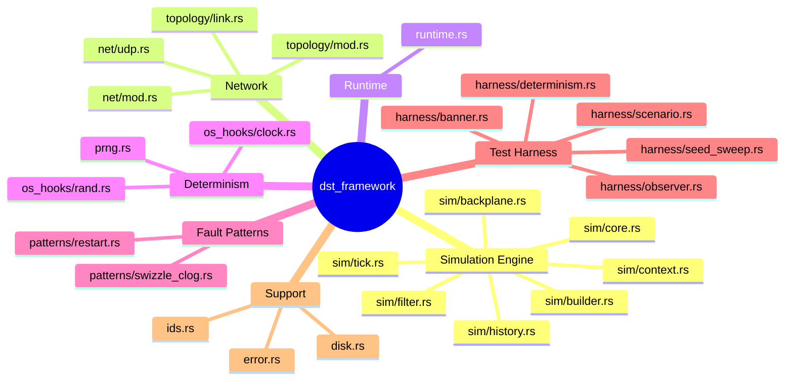

---

## 2. High-Level Architecture

The `Sim` struct is the central orchestrator. It owns the network substrate, all node runtimes, and the event history.

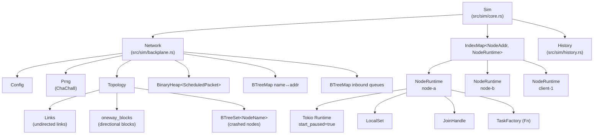

**Key ownership rules:**
- `Sim` owns everything. There is exactly one `Sim` per test.
- `Network` owns the PRNG, topology state, and all packet queues.
- Each `NodeRuntime` owns its own paused Tokio runtime + LocalSet.
- `History` is a ring buffer with a running SHA-256 hash.

---

## 3. Simulation Lifecycle

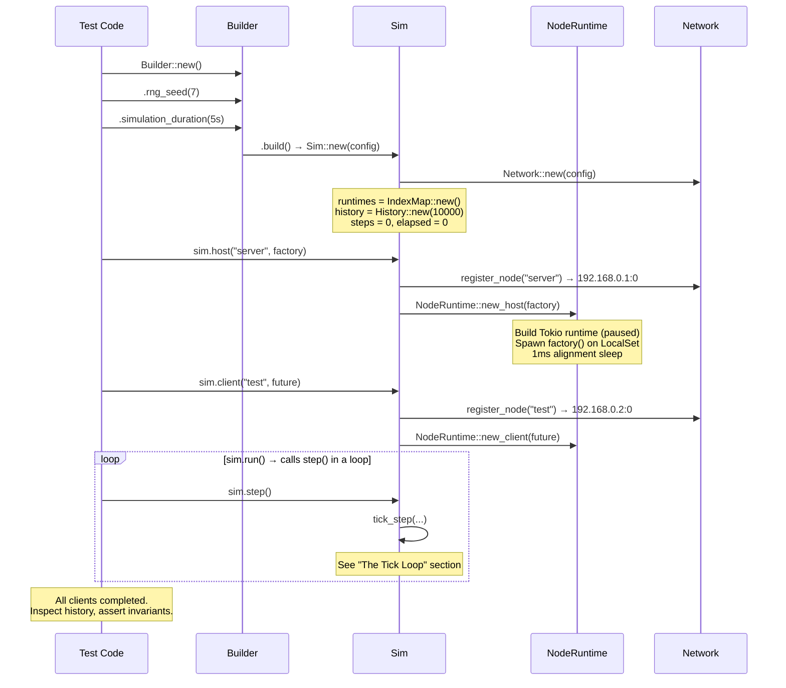

**Three phases of a DST test:**

| Phase | What happens |
|-------|-------------|
| **Setup** | `Builder::new()` → configure → `.build()` → `Sim` created with empty runtimes |
| **Registration** | `sim.host(name, factory)` and `sim.client(name, future)` register nodes, allocate IPs, build per-node Tokio runtimes |
| **Execution** | `sim.run()` loops `step()` until all clients complete. Each step: deliver packets → tick runtimes → advance time. Faults can be injected between steps. |

---

## 4. The Tick Loop

`tick_step()` in `src/sim/tick.rs` is the heart of the framework. Each call advances the simulation by one tick.

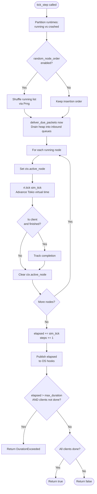

**Step execution order (Turmoil-compatible):**

1. **Partition runtimes** — separate crashed (stopped) from running nodes
2. **Optionally shuffle** running order via seeded RNG (deterministic)
3. **Deliver packets** — `deliver_due_packets(now)` drains the min-heap of all packets with `deliver_at <= now` into per-target inbound queues. Called once globally, not per-host.
4. **Tick each running node** — `rt.tick(sim_tick)` advances each node's Tokio virtual time. Track client completion.
5. **Advance time** — `elapsed += sim_tick`, `steps += 1`. Publish to OS hooks. Check duration cap.

> See [doc/SIMULATION_ENGINE.md](doc/SIMULATION_ENGINE.md) for the full tick loop deep-dive.

---

## 5. Network Substrate (Backplane)

The `Network` (`src/sim/backplane.rs`) is the shared network layer under all nodes. It manages packet scheduling, topology enforcement, and address allocation.

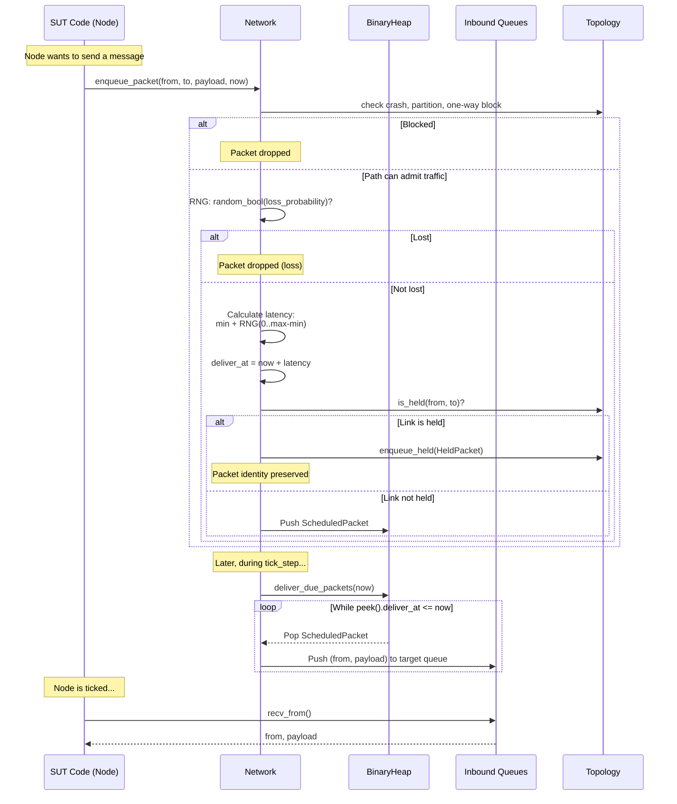

**Key design:**
- **Min-heap** with `Reverse<ScheduledPacket>` for earliest-deadline-first delivery
- **Seq number** breaks ties in the heap (deterministic FIFO for same timestamp)
- **Address allocation** — sequential IPs in `192.168.0.0/16` via `AddrPool`
- **Max inflight** — heap rejects packets when `len >= config.max_inflight` (default 10,000)
- **In-flight fault semantics** — partition, one-way partition, hold, and crash mutate `scheduled_packets` at the fault call. Packets already delivered into a socket inbox are endpoint-buffered and are not pulled back by later network faults.

> See [doc/SIMULATION_ENGINE.md](doc/SIMULATION_ENGINE.md) for the full backplane deep-dive.

---

## 6. Topology & Link States

The `Topology` (`src/topology/mod.rs`) is a composite of three systems that together determine whether a packet can be delivered.

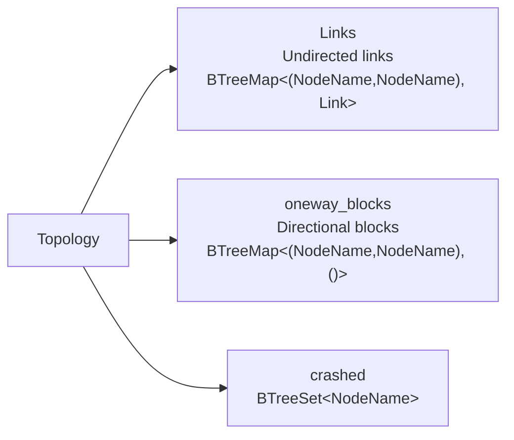

### LinkState State Machine

Each undirected link between two nodes has one of three states:

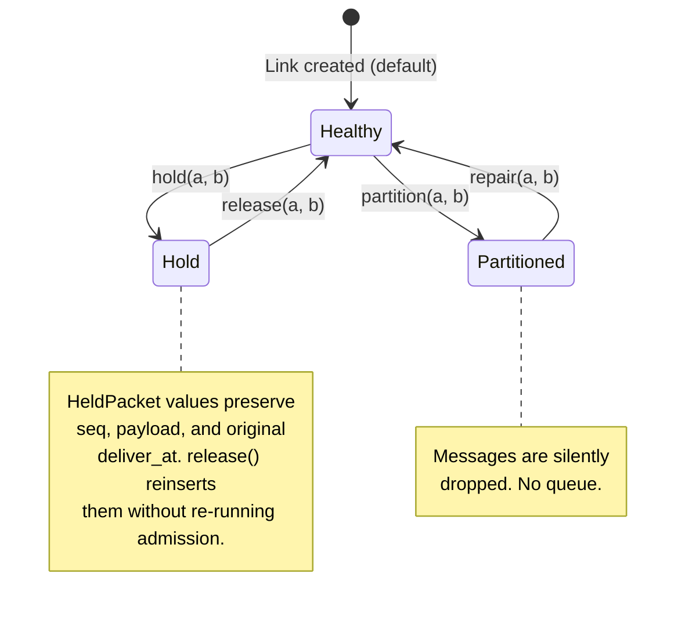

### Delivery Decision Flowchart

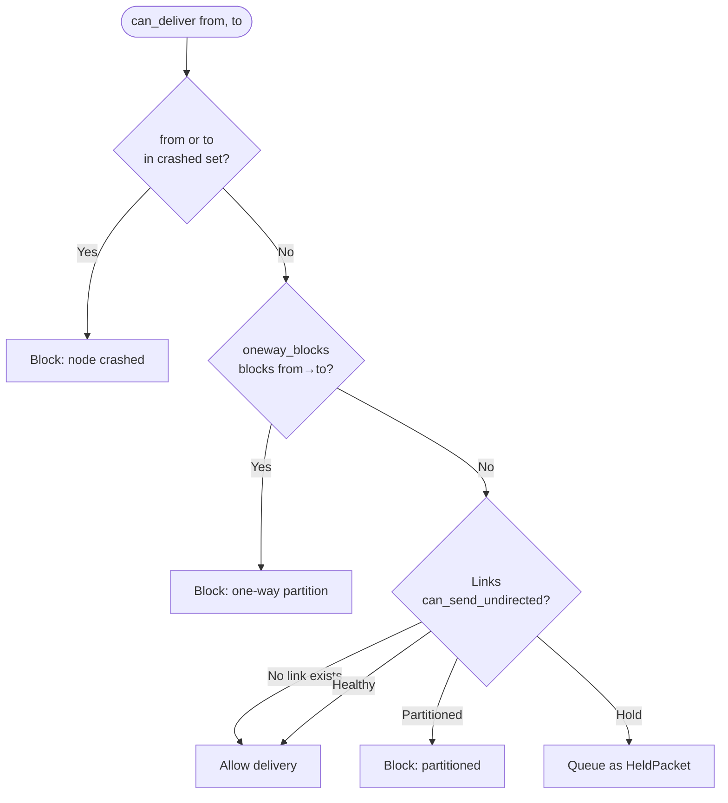

**Canonical pair ordering**: Links use `(min(a,b), max(a,b))` as key, so `link("x","y")` and `link("y","x")` reference the same physical link.

> See [doc/NETWORK_TOPOLOGY.md](doc/NETWORK_TOPOLOGY.md) for the full topology deep-dive.

---

## 7. Fault Injection API

All fault operations are methods on `Sim` (`src/sim/core.rs`). Every operation is recorded in `History`.

| API Call | Fault | What it modifies |
|----------|---------|-----------------|
| `sim.crash(node)` | `Crash` | `rt.crash()` + `topology.crashed.insert(node)` + drop scheduled packets involving node |
| `sim.bounce(node)` | `Bounce` | `topology.crashed.remove(node)` + `rt.bounce()` |
| `sim.partition(a, b)` | `PartitionUndirected` | `topology.links.partition(a, b)` + drop scheduled packets between pair |
| `sim.repair(a, b)` | `RepairUndirected` | `topology.links.repair(a, b)` |
| `sim.hold(a, b)` | `Hold` | `topology.links.hold(a, b)` + move scheduled packets between pair into held buffer |
| `sim.release(a, b)` | `Release` | `topology.links.release(a, b)` + reinsert held packets directly into delivery heap |
| `sim.partition_oneway(from, to)` | `PartitionOneway` | `topology.partition_oneway(from, to)` + drop scheduled packets in blocked direction |
| `sim.repair_oneway(from, to)` | `RepairOneway` | `topology.repair_oneway(from, to)` |

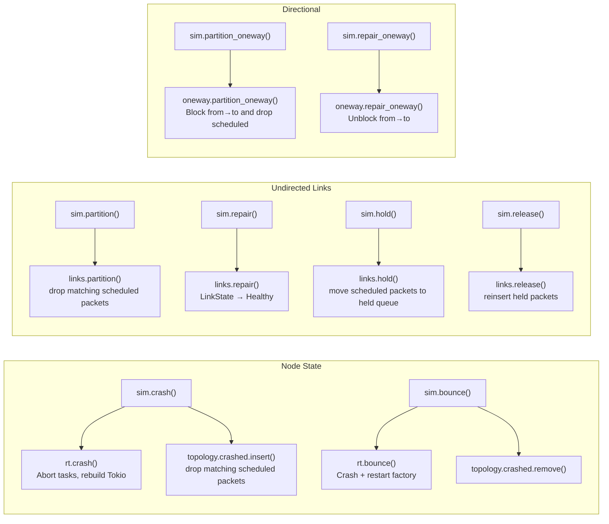

---

## 8. NodeRuntime & Tokio Integration

Each node gets its own `NodeRuntime` (`src/runtime.rs`) wrapping a paused Tokio current-thread runtime.

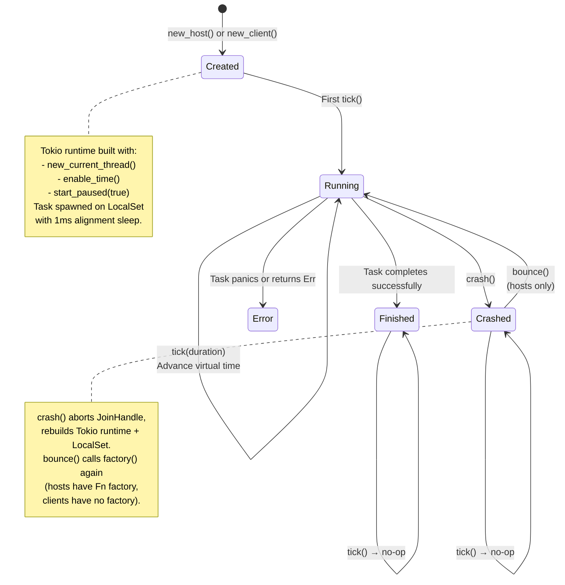

**How `tick(duration)` works:**

```
tokio.block_on(local.run_until(async {
    tokio::time::sleep(duration).await;
}));
```

This advances the paused Tokio runtime's virtual clock by exactly `duration`, executing any ready tasks. The sim driver calls this synchronously for each node, one at a time.

**Host vs Client:**
- **Host** — created with `Fn() -> Future` factory. Can be crashed and bounced (factory re-invoked). Runs indefinitely.
- **Client** — created with `FnOnce` future. One-shot. Cannot be bounced. Client completion drives `sim.run()` termination.

> See [doc/NODE_RUNTIME.md](doc/NODE_RUNTIME.md) for the full runtime deep-dive.

---

## 9. Determinism Guarantees

Determinism is achieved through four mechanisms working together:

| Mechanism | What it controls | Implementation |
|-----------|-----------------|----------------|
| **Seeded PRNG** | Packet latency, loss, node shuffle | `Prng` wraps `ChaCha8Rng` with SHA-256 domain-separated seeding |
| **Paused Tokio** | Virtual time within each node | `start_paused(true)` — time only advances via `sleep()` polls |
| **Insertion-ordered maps** | Host iteration order | `IndexMap<NodeAddr, NodeRuntime>` — not `HashMap` |
| **OS hooks** | External `clock_gettime` / `getrandom` calls | Symbol interposition returns simulated values |
| **`tokio-rng-seed`** (opt-in) | SUT `tokio::select!` branch order | Per-node `Builder::rng_seed` — the only thing that pins `select!`; see below |

### SUT `tokio::select!` ordering (the one non-structural hole)

dst's *own* engine contains no `select!`, so the four mechanisms above make it
deterministic by construction. But **SUT** code that uses `tokio::select!` over
multiple ready branches picks the branch via Tokio's per-runtime `FastRand`. By
default that RNG is seeded (at runtime build) from std's `RandomState` → OS
entropy. The `getrandom` hook **cannot** pin this: `RandomState::new()` caches
its keys per thread on first use and then increments a counter on every call, so
two same-seed runs in one process get *different* `FastRand` seeds — `select!`
order diverges regardless of the hook (verified in
`tests/sim_integration.rs::sut_select_branch_order_deterministic`).

The only fix is to seed each node's `FastRand` directly via Tokio's
`Builder::rng_seed`. That API is unstable, so it lives behind the off-by-default
`tokio-rng-seed` feature **and** requires building with `--cfg tokio_unstable`;
otherwise it is a silent no-op. With both on, each node's `FastRand` is seeded
from `Prng::derive_stream(sim_seed, node_name)`, making SUT `select!` ordering
reproducible independent of OS entropy and link order. See `doc/OS_HOOKS.md`.

### PRNG Architecture

```
Prng::from_seed(7)
  → SHA256("dst_framework::Prng::v1" || 7_u64_le) → [u8; 32]
  → ChaCha8Rng::from_seed([u8; 32])

Prng::derive_stream(7, b"site-a")
  → SHA256("dst_framework::derive_stream::v1" || 7_u64_le || b"site-a") → [u8; 32]
  → ChaCha8Rng::from_seed([u8; 32])
```

- **ChaCha8** (not ChaCha20): faster, sufficient for simulation (not crypto)
- **Domain separation**: version prefix prevents accidental correlation between parent and derived streams
- **Cross-platform**: ChaCha8 produces identical sequences on all architectures

### Determinism Verification

Snapshot a finished run with `sim.run_summary(clients_ok)` and compare two
same-seed runs:
- Same `steps` count
- Same `history_hash` (SHA-256 of all events)
- Same `final_elapsed` and `total_events`

`Sim::run_summary()` is the canonical vehicle. Pass it to
`dst_framework::harness::determinism::assert_same_seed_twice`, or wrap a
sim-factory closure in `verify_same_seed_twice` (or `verify_same_seed_n(n, …)`
to run `n >= 2` times — more samples catch probabilistic nondeterminism such as
an occasionally-flipping `select!`). The `DST_CHECK_DETERMINISM=1`
env var (`check_determinism_enabled()`) gates an opt-in double-run check in
tests. The chaos two-run test (`two_run_hash_equality_full_chaos`) exercises
this with packet loss + latency jitter + crash/bounce/partition, so the seed
contract is empirically proven, not merely argued by construction.

---

## 10. OS Hooks

The `os-hooks` feature (default, Unix only) interposes on libc calls so dependencies see deterministic values.

| Hooked function | Returns during simulation |
|----------------|--------------------------|
| `clock_gettime(CLOCK_MONOTONIC*)` | Sim elapsed since start (the published atomic) |
| `clock_gettime(CLOCK_REALTIME*)` | `Config::epoch + elapsed` (distinct from monotonic) |
| `getrandom()` / `getentropy()` / `CCRandomGenerateBytes()` | Bytes from seeded `StdRng` |

`CLOCK_REALTIME` and `CLOCK_MONOTONIC` are **distinct** sources (E2): a SUT
computing `REALTIME - MONOTONIC` observes the configured wall epoch
(`Builder::wall_clock_epoch`, default `DEFAULT_WALL_CLOCK_EPOCH`), not an
impossible `0`. Elapsed is sourced from a published atomic, not the
`TickContext` RefCell, so a synchronous clock read inside a `UdpSocket`
send/bind cannot trigger a double-borrow panic (R6). In steady-state ticking
the atomic equals the current sim time; at node registration/bounce it is
republished immediately after the alignment-sleep is folded into sim time (R8/C1).

**Caveats (physically unfixable / process-global):**
- **Tokio `Instant` across crash (R8):** `crash()` rebuilds a fresh paused
  Tokio runtime whose virtual `Instant` resets; Tokio exposes no API to
  re-anchor it. SUTs must read time via the hooked `clock_gettime`/`std::time`
  (continuous across crash by construction), **not**
  `tokio::time::Instant::now()`, across a crash boundary.
- **Single-binary hook (R5):** only one copy of the interposed `clock_gettime`
  symbol links per binary. `ClockGuard` is reference-counted (nesting-safe);
  a concurrent `init` from a *different* thread panics loudly. Serialize sims
  that share a process with `os_hooks::clock_test_lock()`, or run them in
  separate test binaries (processes). Sequential sims are isolated by the
  per-construction clock-state reset (C2).

**Harness ordering:**
1. `os_hooks::set_os_rng_from_seed(seed)` — install seeded RNG
2. `let _lock = os_hooks::clock_test_lock()` — serialize if sharing a process
3. `let _guard = os_hooks::ClockGuard::init()` — enable clock interposition
4. Build and run `Sim` (construction resets clock state from `Config::epoch`)
5. Guard drops — decrement refcount; hooks disable at zero

> See [doc/OS_HOOKS.md](doc/OS_HOOKS.md) for the full deep-dive including sequence diagrams.

---

## 11. History & Event Logging

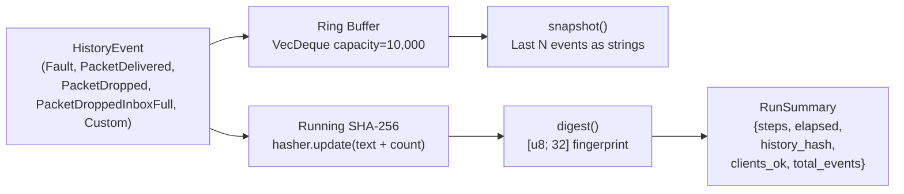

- **Ring buffer** — bounded at 10,000 events. Old events evicted, but the running hash captures everything.
- **Running SHA-256** — each event feeds `format!("{event}")` + `total_count.to_le_bytes()` into the hasher.
- **`digest()`** — clones the hasher and finalizes (non-destructive snapshot).
- **Determinism check** — two runs with the same seed must produce the same `history_hash`.

---

## 12. Scenario & Seed Management

`Scenario` (`src/harness/scenario.rs`) captures a test's configuration for reproduction:

```rust
pub struct Scenario {
    pub seed: u64,
    pub max_simulated_time: Duration,
    pub label: String,
    pub fault_digest: String,
    pub repro_test_filter: Option<String>,
}
```

- `resolve_seed(default)` — reads `DST_SEED` env var, falls back to `default`
- `repro_command_line()` — generates `DST_SEED=N cargo test FILTER` for CI failure reproduction
- `format_banner()` and `format_failure_repro()` in `src/harness/banner.rs` produce a multi-line operator banner with seed and scenario disclosure

---

## 13. Seed Sweeps

`run_seed_sweep` (`src/harness/seed_sweep.rs`) runs a simulation factory across multiple seeds:

```rust
let table = run_seed_sweep(0..100, |seed| {
    let mut sim = Builder::new().rng_seed(seed).build();
    // ... register nodes, run ...
    Ok(summary)
});
println!("{table}"); // "95/100 passed"
for fail in table.failures() {
    println!("Seed {}: {}", fail.seed, fail.error.unwrap());
}
```

`SummaryTable` collects `SeedRunResult` for each seed, provides `passed()`, `failed()`, and `failures()` iterator.

---

## 14. Disk Simulation

`Disk` trait and `MemDisk` implementation (`src/disk.rs`):

```rust
pub trait Disk {
    fn append(&mut self, data: &[u8]) -> Result<u64, Error>;
    fn sync(&mut self) -> Result<(), Error>;
    fn read(&self, offset: u64, len: usize) -> Result<Vec<u8>, Error>;
    fn available_bytes(&self) -> u64;
}
```

**`MemDisk`** tracks `data: Vec<u8>` and `synced_len: usize`. On `crash()`, truncates to `synced_len` — simulating power-loss data loss for unsynced writes. Configurable `fault_probability` for append/sync failures and `delay_range` for latency simulation.

---

## 15. Observer Pattern

`Observer` trait (`src/harness/observer.rs`) provides per-step invariant checking:

```rust
pub trait Observer {
    fn on_step_end(&mut self, digest: &StepStats) -> Result<(), Error>;
}
```

**`StepStats`** contains: `steps`, `elapsed`, `events_since_last_observer`, `packets_delivered`, `packets_dropped`, `faults_applied`.

Multiple observers can be registered via `Sim::add_observer`; each is invoked in registration order at the end of every step.

Built-in implementations:
- **`NoopObserver`** — does nothing (default)
- **`ProgressWatchdog`** — counts consecutive idle steps (no events), errors with `Error::NoProgress` if threshold exceeded

Linearizability checkers, model checkers, and custom property assertions live in test code and implement this trait — the framework provides the hook, not the checker.

---

## 16. Fault Patterns

Pre-built reusable fault sequences in `src/patterns/`:

### RollingRestart (`src/patterns/restart.rs`)

Simulates rolling hardware restarts or deployment rollouts. Crashes and bounces nodes one at a time with configurable timing.

### RollingNetworkClog (`src/patterns/swizzle_clog.rs`)

Inspired by FoundationDB's "swizzle-clog" test. Holds links on a subset of nodes one-by-one (clogging), then releases them in a different random order (unclogging). Simulates cascading network latency spikes.

> See [doc/FAULT_PATTERNS.md](doc/FAULT_PATTERNS.md) for state machine diagrams and detailed walkthroughs.

---

## 17. Module Dependency Graph

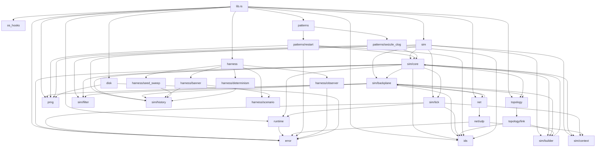

---

## 18. Design Decisions & Rationale

| Decision | Why |
|----------|-----|
| **ChaCha8 (not ChaCha20)** | 2.5x faster; sufficient for simulation PRNG (not doing crypto). Cross-platform identical output. |
| **SHA-256 domain separation** | `"dst_framework::Prng::v1"` prefix prevents correlation between the master RNG and derived streams. Different framework versions produce different sequences. |
| **IndexMap for runtimes** | Insertion-order iteration eliminates `HashMap`'s random iteration non-determinism. Matches Turmoil's behavior. |
| **BTreeMap for topology** | Deterministic sorted iteration order. Required for canonical pair key ordering in `Links`. |
| **`start_paused(true)`** | Tokio's test utility freezes time. `tokio::time::sleep(d)` only advances when polled. Sim driver controls all time advancement. |
| **`spin::Mutex` in OS hooks** | `std::sync::Mutex` is unsafe when called from within the global allocator (which may trigger `getrandom`). Spinlock avoids TLS and pthread dependencies. |
| **Canonical pair ordering** | `(min(a,b), max(a,b))` ensures `link(A,B)` and `link(B,A)` reference the same physical link. Prevents duplicate/inconsistent state. |
| **Host = `Fn`, Client = `FnOnce`** | Hosts need restartability (bounce re-invokes factory). Clients are one-shot. |
| **Ring buffer + running hash** | 10,000 events in the ring buffer for debugging; SHA-256 running hash captures the full execution fingerprint for determinism verification without unbounded memory. |
| **1ms alignment sleep on spawn** | Ensures the spawned task has been polled at least once before the first real tick. Matches Turmoil behavior. |
| **Seq number on packets** | Breaks ties in the min-heap when multiple packets have the same `deliver_at`. Ensures deterministic FIFO ordering. |

---

## Quick Start

```rust
use dst_framework::{Builder, Sim};
use std::time::Duration;

#[test]
fn my_dst_test() {
    let mut sim = Builder::new()
        .rng_seed(7)
        .simulation_duration(Duration::from_secs(5))
        .build();

    sim.host("server", || async {
        loop {
            tokio::time::sleep(Duration::from_millis(100)).await;
        }
    }).unwrap();

    sim.client("test", async {
        tokio::time::sleep(Duration::from_millis(200)).await;
        Ok(())
    }).unwrap();

    // Inject faults during execution
    for _ in 0..50 {
        sim.step().unwrap();
    }
    sim.partition("server", "test");
    for _ in 0..20 {
        sim.step().unwrap();
    }
    sim.repair("server", "test");

    sim.run().unwrap();
}
```

---

## Further Reading

| Document | Covers |
|----------|--------|
| [doc/SIMULATION_ENGINE.md](doc/SIMULATION_ENGINE.md) | `src/sim/` — Builder, Sim struct, tick loop, backplane |
| [doc/NODE_RUNTIME.md](doc/NODE_RUNTIME.md) | `src/runtime.rs` — Tokio integration, crash/bounce, virtual time |
| [doc/NETWORK_TOPOLOGY.md](doc/NETWORK_TOPOLOGY.md) | `src/topology/` — LinkState machine, partitions, holds |
| [doc/NETWORK_IO.md](doc/NETWORK_IO.md) | `src/net/` — Simulated UDP, name resolution |
| [doc/FAULT_PATTERNS.md](doc/FAULT_PATTERNS.md) | `src/patterns/` — RollingRestart, RollingNetworkClog |
| [doc/OS_HOOKS.md](doc/OS_HOOKS.md) | `src/os_hooks/` — clock_gettime, getrandom interposition |
