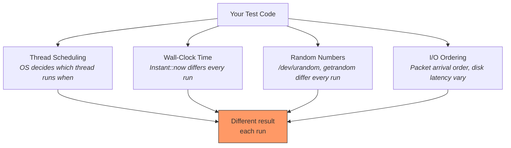
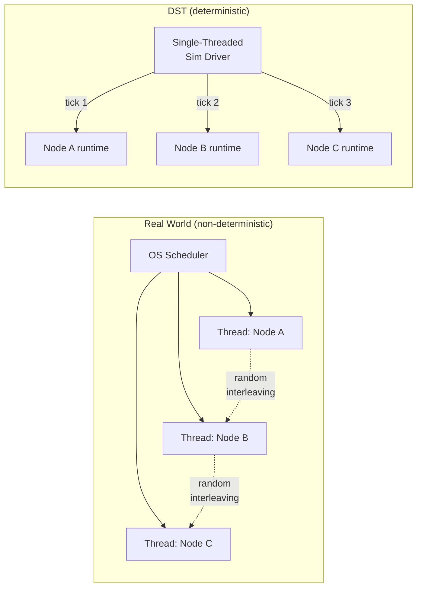
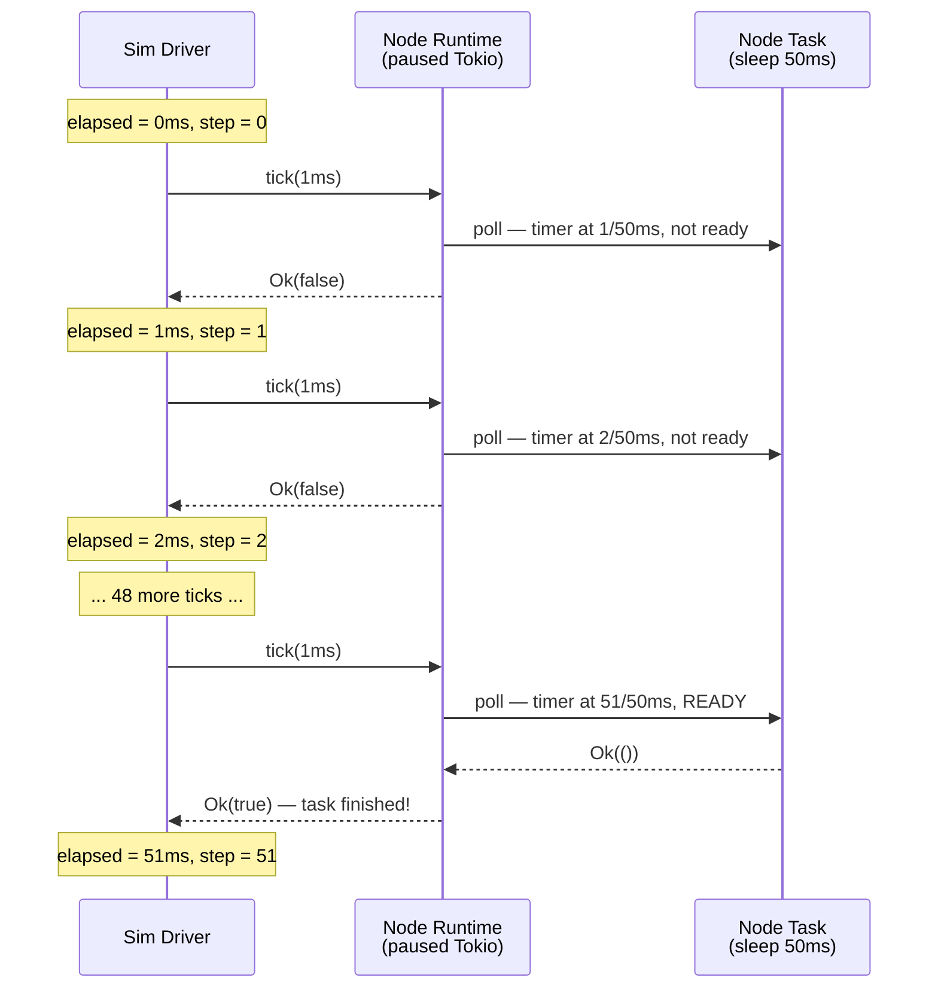
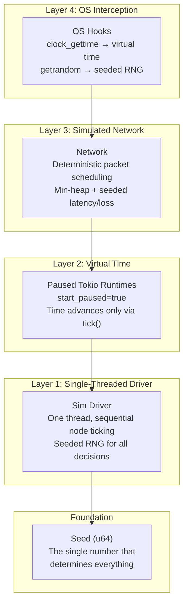
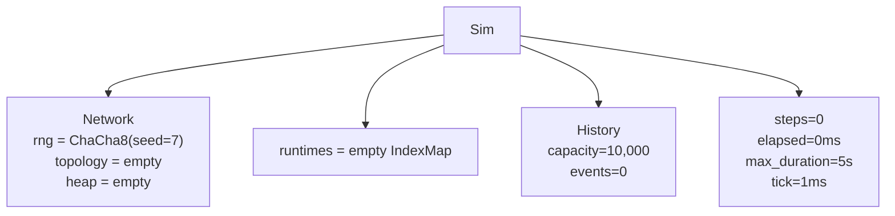
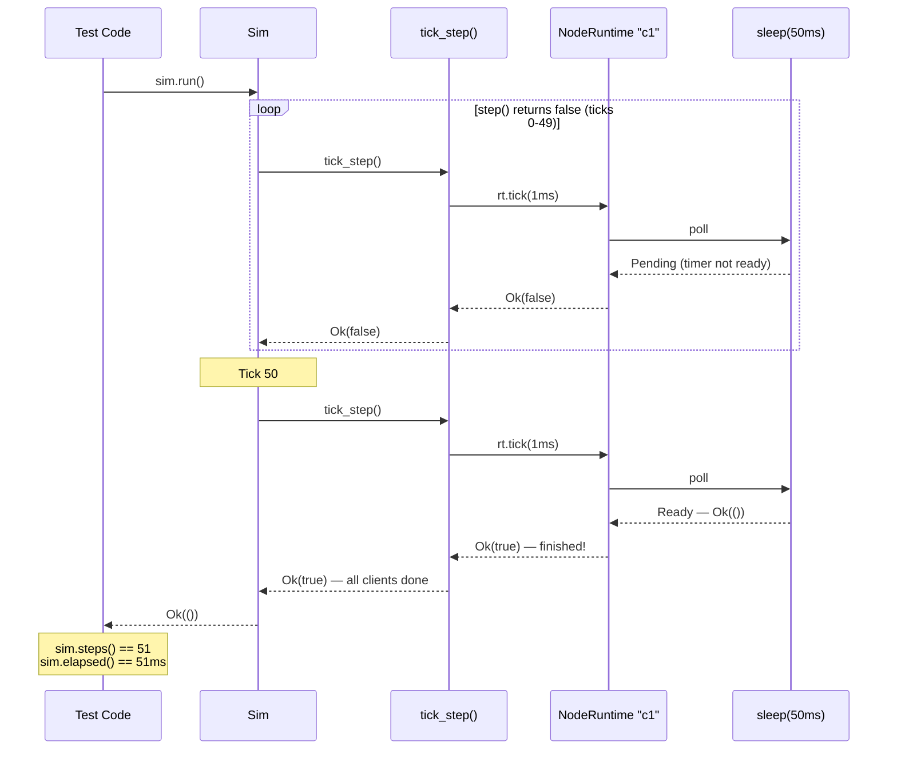
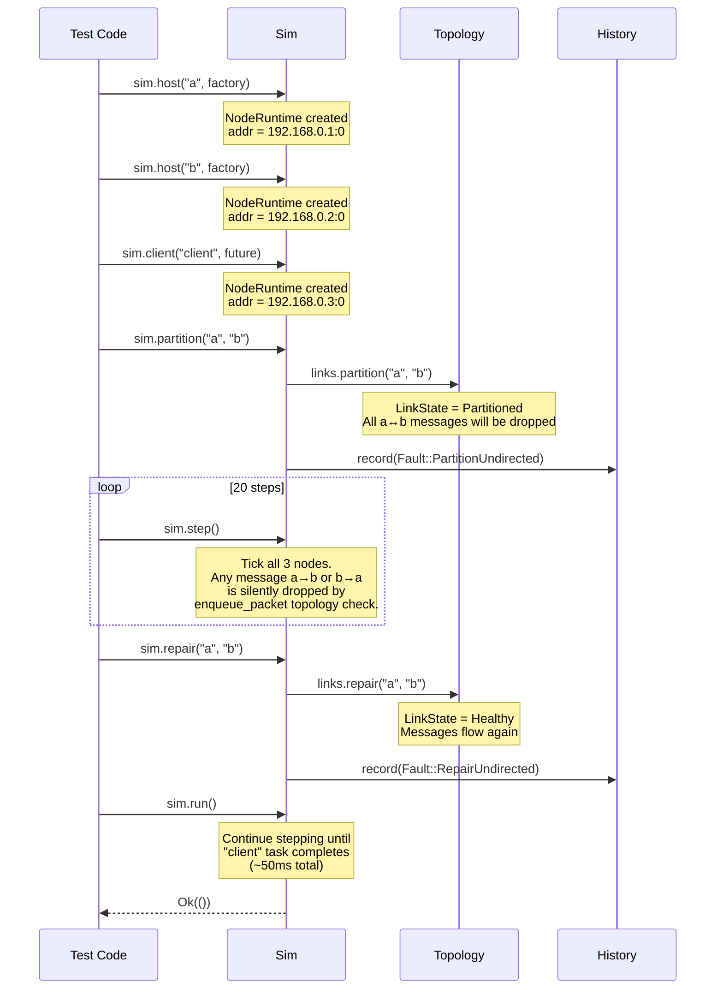

# Deterministic Simulation Testing from First Principles

> This guide assumes no prior knowledge of DST. Start here, then move to
> [ARCHITECTURE.md](../ARCHITECTURE.md) for the full reference.

---

## Table of Contents

**Part 1: The Problem**
1. [Why Testing Distributed Systems Is Hard](#1-why-testing-distributed-systems-is-hard)
2. [What Is Non-Determinism?](#2-what-is-non-determinism)
3. [The DST Idea](#3-the-dst-idea)

**Part 2: How This Crate Achieves Determinism**
4. [Eliminating Thread Scheduling Non-Determinism](#4-eliminating-thread-scheduling-non-determinism)
5. [Eliminating Time Non-Determinism](#5-eliminating-time-non-determinism)
6. [Eliminating Random Number Non-Determinism](#6-eliminating-random-number-non-determinism)
7. [Eliminating I/O Ordering Non-Determinism](#7-eliminating-io-ordering-non-determinism)
8. [The Determinism Stack](#8-the-determinism-stack)

**Part 3: Walking Through a Test Execution**
9. [A Concrete Example](#9-a-concrete-example)
10. [Step 1 -- Building the Simulation](#10-step-1--building-the-simulation)
11. [Step 2 -- Registering a Client](#11-step-2--registering-a-client)
12. [Step 3 -- Running the Simulation](#12-step-3--running-the-simulation)
13. [Step 4 -- Why It's Deterministic](#13-step-4--why-its-deterministic)
14. [A More Complex Example -- Fault Injection](#14-a-more-complex-example--fault-injection)

**Part 4: Reference**
15. [Glossary](#15-glossary)
16. [Where to Go Next](#16-where-to-go-next)

---

# Part 1: The Problem

## 1. Why Testing Distributed Systems Is Hard

Distributed systems are systems where multiple processes (nodes) communicate
over a network to achieve a shared goal. Databases like SurrealDB, consensus
protocols like Raft, and message queues like Kafka are all distributed systems.

These systems must handle a brutal reality: **things fail all the time**.
Networks drop packets. Disks corrupt data. Processes crash mid-write. Clocks
drift between machines. And the bugs that emerge from these failures are the
worst kind -- they're rare, hard to reproduce, and devastating in production.

Consider a bug that only manifests when:
- Node A sends a write to Node B
- The network delays that write by exactly 47ms
- Node C happens to start an election in that 47ms window
- Node A crashes before receiving B's acknowledgment

This scenario might occur once in a million runs. Traditional unit tests will
never find it. Integration tests on real infrastructure might hit it once, but
you can't reproduce it because the next run has different timing.

These are called **Heisenbugs** -- bugs that disappear when you try to observe
them, because the act of debugging (adding logs, attaching a debugger, running
slowly) changes the timing that caused the bug.

## 2. What Is Non-Determinism?

Non-determinism means: **same inputs, different outputs across runs.**

When you run a function like `fn add(a: i32, b: i32) -> i32`, it always
returns the same result for the same inputs. That's deterministic. But
distributed systems are full of operations that produce different results
each time:



**The four sources of non-determinism:**

| Source | Example | Why it changes between runs |
|--------|---------|---------------------------|
| **Thread scheduling** | Two threads write to shared state | OS scheduler makes different choices based on system load |
| **Wall-clock time** | `Instant::now()`, `SystemTime::now()` | Real time always moves forward at different rates |
| **Random numbers** | `getrandom()`, `/dev/urandom` | OS entropy pool produces different bytes each call |
| **I/O ordering** | Network packet delivery, disk latency | Physical hardware introduces variable delays |

If any of these are present in your test, running the same test twice can
produce different behavior. That means a failing test might pass on re-run, and
a passing test might hide a real bug.

## 3. The DST Idea

What if we could control **all four** sources of non-determinism?

What if every random number, every timestamp, every packet delivery, and every
thread schedule was determined by a single number -- a **seed** -- and using
the same seed always produced the exact same execution?

That's Deterministic Simulation Testing.

**The seed contract: same seed = same execution = same result. Always.**

Instead of running your distributed system on real machines with real networks,
you run it inside a **simulation**. The simulation controls everything:

- **No real threads.** A single-threaded driver decides which node runs when.
- **No real time.** Virtual clocks advance only when the driver says so.
- **No real randomness.** A seeded pseudo-random number generator produces
  repeatable sequences.
- **No real network.** A simulated network delivers packets with
  deterministic timing.

Your actual application code (the "system under test") runs unmodified inside
this simulation. It calls `tokio::time::sleep()`, it sends UDP packets, it
reads the clock -- but every one of those calls is intercepted by the
simulation and given a deterministic answer.

**FoundationDB** pioneered this approach and famously attributed their
reliability to simulation testing: they found bugs that would have taken years
to discover in production. This crate (`dst_framework`) brings the same
technique to Rust and Tokio.

**DST vs Jepsen:**

| | DST (this crate) | Jepsen |
|---|---|---|
| **Approach** | White-box: runs your code in a simulated world | Black-box: tests real binaries on real VMs |
| **Determinism** | Fully deterministic -- failures always reproducible | Non-deterministic -- relies on random fault timing |
| **Speed** | Thousands of test iterations per second | Minutes to hours per run |
| **Fidelity** | Simulated network/disk (close to real, not identical) | Real network/disk (exact production behavior) |
| **Best for** | Finding protocol bugs early in development | Validating production-ready systems |

They're complementary: use DST during development to find bugs fast, then
Jepsen to validate the final system.

---

# Part 2: How This Crate Achieves Determinism

## 4. Eliminating Thread Scheduling Non-Determinism

**The problem:** In a real distributed system test, you might spin up 3 Tokio
runtimes on separate threads. The OS thread scheduler decides which one runs
when. Two runs of the same test will interleave differently.

**The solution:** `dst_framework` uses a **single-threaded simulation driver**.

There is exactly one thread. It owns the `Sim` struct, which contains every
node's Tokio runtime. The driver decides the order nodes are polled and
advances each one sequentially.



Each node gets its own Tokio `current_thread` runtime. These runtimes don't
run on separate threads -- they're objects sitting in memory, and the sim
driver calls `tick()` on each one in sequence. Inside a single `tick()` call,
Tokio's cooperative scheduler runs whatever futures are ready, but the driver
controls which node is ticked and in what order.

If `random_node_order` is enabled, the order is shuffled each step -- but
using the simulation's seeded RNG, so the shuffle is also deterministic.

## 5. Eliminating Time Non-Determinism

**The problem:** Code calls `Instant::now()`, `SystemTime::now()`, or
`tokio::time::sleep()`. In a real system these read the wall clock, which is
different every run.

**The solution:** Each node's Tokio runtime is created with
`start_paused(true)`.

This is a Tokio test utility that **freezes time**. When time is paused,
`tokio::time::sleep(Duration::from_millis(100))` does not wait 100
milliseconds of real time. Instead, it registers a timer that fires when the
runtime's virtual clock has been advanced by 100ms.

The sim driver advances virtual time by calling:

```rust
rt.tick(Duration::from_millis(1)); // advance this node's clock by 1ms
```

This means the simulation's `tick_duration` (default: 1ms) controls how fast
virtual time moves. A `sleep(50ms)` will take ~50 ticks to fire.



**What about code that bypasses Tokio?** Some C libraries or Rust crates call
`libc::clock_gettime()` directly. The `os-hooks` feature (enabled by default
on Unix) interposes on this function at the linker level, returning the
simulation's virtual time instead of the real wall clock.

## 6. Eliminating Random Number Non-Determinism

**The problem:** Code calls `getrandom()` or reads `/dev/urandom` to get
random bytes. The OS entropy pool produces different bytes every time.

**The solution:** A **seeded PRNG** drives every random decision.

When you create a simulation with `Builder::new().rng_seed(7)`, the framework
creates a `Prng` -- a wrapper around ChaCha8Rng (a cryptographic-grade PRNG
that's fast and produces identical output across all platforms).

Every random decision in the simulation draws from this PRNG:
- How much latency to add to a packet? → Draw from RNG.
- Should this packet be dropped (loss simulation)? → Draw from RNG.
- What order should nodes be ticked? → Shuffle using RNG.

Because the PRNG is seeded, the same seed always produces the same sequence
of random numbers, which means the same decisions, which means the same
execution.

**Seed derivation** uses SHA-256 domain separation to prevent accidental
correlation:

```
Seed 7
  → SHA-256("dst_framework::Prng::v1" + bytes_of(7))
  → [u8; 32]
  → ChaCha8Rng::from_seed([u8; 32])
```

**Reproducing failures:** When a test fails, the framework prints the seed:

```
DST_SEED=7 cargo test my_test_name
```

Run that command and you get the exact same execution, every time. This is the
most powerful property of DST: bugs are always reproducible.

**What about code that bypasses Rust's `rand` crate?** Some libraries call
`libc::getrandom()` directly. The `os-hooks` feature interposes on this
function, filling the buffer from a seeded `StdRng` instead of the OS.

## 7. Eliminating I/O Ordering Non-Determinism

**The problem:** Real networks deliver packets in unpredictable order with
unpredictable latency. Two runs of the same test will see different packet
arrival sequences.

**The solution:** A **simulated network** with deterministic scheduling.

When a node sends a packet, it doesn't go through the OS network stack.
Instead, it enters the `Network` (the "backplane"), which:

1. Checks if the path is crashed or partitioned → drop if blocked
2. Draws a random loss decision from the seeded RNG
3. Draws a random latency from the seeded RNG: `min_latency + rand(0..max-min)`
4. Computes the packet's delivery time at `now + latency`
5. Queues the packet in a held-link buffer or pushes it into a min-heap ordered by delivery time

Each tick, the backplane drains all heap packets whose delivery time has passed
and pushes them into destination socket inboxes. Because every random draw comes from
the same seeded RNG, the same seed produces the same latencies, the same loss
decisions, and the same delivery order.

**Tie-breaking:** When two packets have the same delivery time, a sequence
number breaks the tie. This ensures deterministic FIFO ordering even when
latency draws collide.

**Map ordering:** The framework uses `IndexMap` (insertion-ordered) for node
runtimes and `BTreeMap` (sorted) for topology state, never `HashMap` (which
iterates in random order). This eliminates iteration-order non-determinism.

## 8. The Determinism Stack

All four solutions work together as a layered stack:



The seed flows up through every layer. Change the seed and you explore a
different execution. Keep the seed and you replay the exact same execution.

---

# Part 3: Walking Through a Test Execution

## 9. A Concrete Example

Let's trace exactly what happens when this test runs. This is a real test
from `tests/sim_integration.rs`:

```rust
use std::time::Duration;
use dst_framework::Builder;

#[test]
fn client_sleeps_then_completes() {
    let mut sim = Builder::new()
        .rng_seed(7)
        .tick_duration(Duration::from_millis(1))
        .simulation_duration(Duration::from_secs(5))
        .build();

    sim.client("c1", async {
        tokio::time::sleep(Duration::from_millis(50)).await;
        Ok(())
    })
    .unwrap();

    sim.run().unwrap();

    assert!(sim.steps() >= 48);
    assert!(sim.steps() <= 55);
}
```

The test creates a simulation, registers one client that sleeps for 50ms, and
runs until the client completes. Let's follow every layer.

## 10. Step 1 -- Building the Simulation

```rust
let mut sim = Builder::new()
    .rng_seed(7)
    .tick_duration(Duration::from_millis(1))
    .simulation_duration(Duration::from_secs(5))
    .build();
```

**`Builder::new()`** creates a `Config` with defaults:

| Field | Default | Our override |
|-------|---------|-------------|
| `tick` | 1ms | 1ms (same) |
| `max_duration` | 10s | 5s |
| `rng_seed` | 0 | 7 |
| `max_inflight` | 10,000 | 10,000 |
| `link.min_latency` | 0ms | 0ms |
| `link.max_latency` | 100ms | 100ms |
| `link.loss_probability` | 0.0 | 0.0 |
| `random_node_order` | false | false |

**`.build()`** calls `Sim::new(config)`, which creates:

- **`Network`** -- the backplane. It initializes:
  - `Prng::from_seed(7)` -- the master PRNG (ChaCha8, seeded via SHA-256)
  - `Topology::new()` -- empty link map, no partitions, no crashes
  - Empty packet heap, empty address maps
- **`runtimes: IndexMap::new()`** -- no nodes registered yet
- **`history: History::new(10_000)`** -- ring buffer for events, SHA-256 hasher
- **`steps: 0, elapsed: Duration::ZERO`**



At this point, the simulation exists but has no nodes. It's an empty virtual
world.

## 11. Step 2 -- Registering a Client

```rust
sim.client("c1", async {
    tokio::time::sleep(Duration::from_millis(50)).await;
    Ok(())
}).unwrap();
```

This call does four things:

**1. Duplicate check** -- is "c1" already registered? No, so we continue.

**2. Address allocation** -- `network.register_node("c1")`:
- The `AddrPool` assigns the next IP: `192.168.0.1`
- A `NodeAddr` is created: `192.168.0.1:0`
- Bidirectional maps are updated: `"c1" → 192.168.0.1:0` and `192.168.0.1:0 → "c1"`

**3. Runtime creation** -- `NodeRuntime::new_client("c1", future)`:
- **Build Tokio runtime:**
  ```rust
  tokio::runtime::Builder::new_current_thread()
      .enable_time()       // enable tokio::time (timers, sleep)
      .start_paused(true)  // FREEZE TIME -- this is the key
      .build()
  ```
  This creates a single-threaded Tokio runtime where time is frozen. No timers
  fire until the sim driver explicitly advances time.

- **Spawn the task:**
  ```rust
  tokio.block_on(local.run_until(async {
      let handle = tokio::task::spawn_local(future);
      tokio::time::sleep(Duration::from_millis(1)).await; // alignment
      handle
  }))
  ```
  The future is spawned onto a `LocalSet` (single-threaded task pool). The 1ms
  alignment sleep ensures the task has been polled at least once before the
  first real tick.

- **Store metadata:** `is_client = true`, `crashed = false`, `finished = false`,
  `task_factory = None` (clients can't be bounced).

**4. Insert into runtimes** -- the `NodeRuntime` is stored in the `IndexMap`
at key `192.168.0.1:0`.

Now the simulation has one node: a client named "c1" with a paused Tokio
runtime containing a task that wants to sleep for 50ms.

## 12. Step 3 -- Running the Simulation

```rust
sim.run().unwrap();
```

`run()` calls `step()` in a loop until it returns `Ok(true)` (all clients
done) or an error.

Each `step()` call invokes `tick_step()`. Let's walk through the first tick:

---

**Tick 0** (`steps=0, elapsed=0ms`)

| Phase | What happens |
|-------|-------------|
| **Deliver packets** | `deliver_due_packets(now)` (here `now = 0ms`) -- heap is empty, nothing to deliver |
| **Build running set** | "c1" is not crashed → goes in `running` list (crashed nodes are simply skipped; there is no separate stopped list) |
| **Shuffle** | `random_node_order = false` → skip |
| **Tick "c1"** | `rt.tick(1ms)` advances Tokio virtual time by 1ms. The `sleep(50ms)` timer is now at 1ms of 50ms -- not ready. Task stays pending. |
| **Client check** | "c1" is a client and NOT finished → `all_clients_done = false` |
| **Advance time** | `elapsed = 1ms, steps = 1` |
| **Duration check** | `1ms < 5s` -- OK (the only loop guard is `elapsed > max_duration`; there is no step-count limit) |
| **Result** | Return `Ok(false)` -- not done |

---

**Ticks 1 through 49** -- identical to tick 0. Each tick advances virtual time
by 1ms. The `sleep(50ms)` timer accumulates but doesn't fire.

---

**Tick 50** (`steps=50, elapsed=50ms`)

| Phase | What happens |
|-------|-------------|
| **Tick "c1"** | `rt.tick(1ms)` advances virtual time to 51ms total (50 ticks + 1ms alignment). The `sleep(50ms)` timer **fires**. The async block reaches `Ok(())` and completes. |
| **Task detection** | `handle.is_finished() == true`. The runtime collects the result: `Ok(Ok(()))`. Sets `finished = true`. Returns `Ok(true)`. |
| **Client check** | "c1" is a client and IS finished → `all_clients_done = true` |
| **Result** | Return `Ok(true)` -- all clients done! |

`run()` sees `Ok(true)` and returns `Ok(())`. The test passes.



## 13. Step 4 -- Why It's Deterministic

Run this test a hundred times. You'll get the same result every time:
~51 steps, ~51ms elapsed. The `deterministic_same_seed` test in
`tests/sim_integration.rs` proves this:

```rust
fn run_sim(seed: u64) -> (u64, Duration) {
    let mut sim = Builder::new()
        .rng_seed(seed)
        .simulation_duration(Duration::from_secs(5))
        .build();
    sim.client("c", async {
        tokio::time::sleep(Duration::from_millis(50)).await;
        Ok(())
    }).unwrap();
    sim.run().unwrap();
    (sim.steps(), sim.elapsed())
}

let (steps_a, elapsed_a) = run_sim(7);
let (steps_b, elapsed_b) = run_sim(7);
assert_eq!(steps_a, steps_b);     // always equal
assert_eq!(elapsed_a, elapsed_b); // always equal
```

Why? Because nothing in this execution depends on anything non-deterministic:
- No real threads (single-threaded driver)
- No real time (`start_paused(true)`)
- No real randomness (no RNG draws needed for this simple test)
- No real I/O (no network messages)

In a more complex test with network messages, the seeded RNG would control
latency and loss decisions -- still deterministic for a given seed, but
different between seeds.

## 14. A More Complex Example -- Fault Injection

Now let's trace a test with faults. From `tests/sim_integration.rs`:

```rust
#[test]
fn partition_and_repair() {
    let mut sim = Builder::new()
        .rng_seed(44)
        .simulation_duration(Duration::from_secs(5))
        .build();

    // Two long-running hosts
    sim.host("a", || async {
        loop { tokio::time::sleep(Duration::from_millis(10)).await; }
        #[allow(unreachable_code)] Ok(())
    }).unwrap();

    sim.host("b", || async {
        loop { tokio::time::sleep(Duration::from_millis(10)).await; }
        #[allow(unreachable_code)] Ok(())
    }).unwrap();

    // Client drives completion
    sim.client("client", async {
        tokio::time::sleep(Duration::from_millis(50)).await;
        Ok(())
    }).unwrap();

    // Inject a partition between a and b
    sim.partition("a", "b");

    // Step through the partition
    for _ in 0..20 {
        sim.step().unwrap();
    }

    // Repair the partition
    sim.repair("a", "b");

    // Run to completion
    sim.run().unwrap();
}
```

Here's what happens at each phase:



**What happens to messages during the partition:**

When `a` tries to send a packet to `b`, the backplane sees that the link is
`Partitioned` and drops the packet -- no error to the sender, just like a real
network partition. If the partition is injected while a packet is already
scheduled but not delivered, that in-flight packet is dropped immediately.

After `repair()`, the link returns to `Healthy` and messages flow normally.

**Hosts vs Clients:** Notice that hosts are created with `|| async { ... }` (a
closure that returns a future). This `Fn` factory allows the framework to
**restart** a host after a crash -- it calls the factory again to get a fresh
future. Clients use a plain `async { ... }` (consumed once, cannot restart).

**The hold/release alternative:** Instead of `partition` (which drops messages),
you can use `hold` (which queues admitted packets without changing their packet
identity) and later `release` (which reinserts held packets into the delivery
heap). This simulates temporary network congestion rather than a full partition.

---

# Part 4: Reference

## 15. Glossary

| Term | Definition |
|------|-----------|
| **Sim** | The central simulation struct. Owns all nodes, the network, and the event history. Created via `Builder`. |
| **Host** | A long-running simulated node (e.g., a database server). Created with `sim.host(name, factory)`. Has a task factory (`Fn`) so it can be crashed and bounced (restarted). |
| **Client** | A one-shot simulated node (e.g., a test driver). Created with `sim.client(name, future)`. When all clients complete, `sim.run()` returns. Cannot be bounced. |
| **Tick** | One step of the simulation. Advances virtual time by `tick_duration` (default 1ms). Delivers due packets, polls all running nodes. |
| **Step** | Synonym for tick. `sim.step()` executes one tick. `sim.steps()` returns how many ticks have executed. |
| **Seed** | A `u64` that determines the entire execution. Same seed = same run. Set via `Builder::rng_seed(seed)`. |
| **Backplane** | The `Network` -- manages packet scheduling, topology, and address allocation. The simulated network. |
| **Topology** | `Topology` -- tracks which links are healthy, partitioned, or held, which nodes are crashed, and which one-way paths are blocked. |
| **LinkState** | The state of an undirected link between two nodes: `Healthy`, `Partitioned` (drop messages), or `Hold` (queue messages for later release). |
| **Partition** | Blocking communication between two nodes. Undirected (`partition`/`repair`) blocks both directions. One-way (`partition_oneway`/`repair_oneway`) blocks one direction. |
| **Hold/Release** | Like a partition, but admitted packets are queued instead of dropped. `release()` reinserts held packets into the delivery heap without re-running loss or filters. |
| **Crash** | Abort a host's tasks and rebuild its Tokio runtime. The node stops ticking. |
| **Bounce** | Crash then restart a host from its task factory. Simulates a process restart. |
| **History** | A ring buffer of events (faults, packet deliveries, packet drops, filter changes) with a running SHA-256 hash for determinism verification. |
| **Prng** | The simulation's PRNG. Wraps ChaCha8Rng with SHA-256 domain-separated seeding. Every random decision draws from this. |
| **Seed Sweep** | Running the same test across many seeds to explore different executions. `run_seed_sweep(0..1000, factory)` tests 1000 different random schedules. |
| **OS Hooks** | Symbol interposition (`#[no_mangle]`) that intercepts `clock_gettime` and `getrandom` at the libc level, returning simulated values. |

## 16. Where to Go Next

Now that you understand the fundamentals, the reference documentation explains
each component in detail:

| Document | What you'll learn |
|----------|------------------|
| [ARCHITECTURE.md](../ARCHITECTURE.md) | Full system overview with 12 Mermaid diagrams covering every module and their interactions |
| [doc/SIMULATION_ENGINE.md](SIMULATION_ENGINE.md) | Builder API, Sim struct internals, tick loop step-by-step, packet scheduling |
| [doc/NODE_RUNTIME.md](NODE_RUNTIME.md) | How each node's Tokio runtime works, crash/bounce mechanics, virtual time |
| [doc/NETWORK_TOPOLOGY.md](NETWORK_TOPOLOGY.md) | LinkState machine, partition types, the `can_deliver` algorithm |
| [doc/NETWORK_IO.md](NETWORK_IO.md) | Simulated UDP sockets, channel-based I/O, name resolution |
| [doc/FAULT_PATTERNS.md](FAULT_PATTERNS.md) | Pre-built patterns: RollingRestart, RollingNetworkClog |
| [doc/OS_HOOKS.md](OS_HOOKS.md) | How clock_gettime and getrandom interposition works |

**Recommended reading order:**
1. You are here (BEGINNER.md)
2. [ARCHITECTURE.md](../ARCHITECTURE.md) -- the full map
3. [SIMULATION_ENGINE.md](SIMULATION_ENGINE.md) -- the core
4. [NODE_RUNTIME.md](NODE_RUNTIME.md) -- virtual time mechanics
5. Everything else as needed
