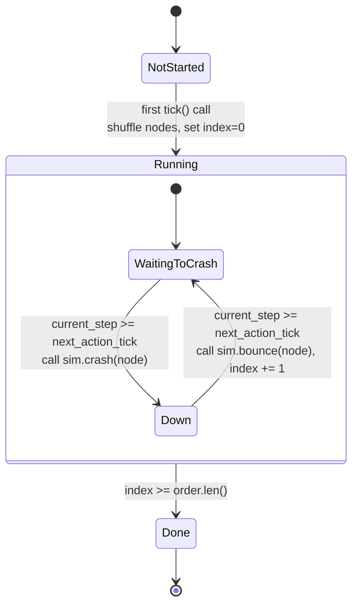
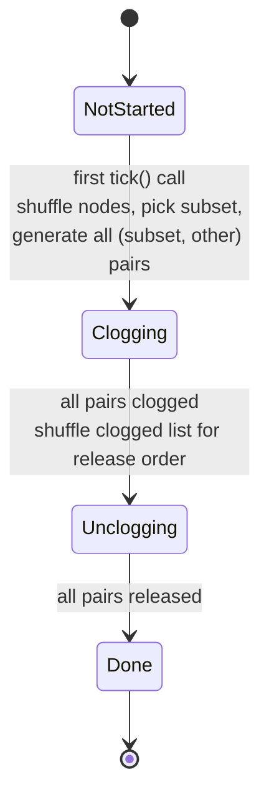
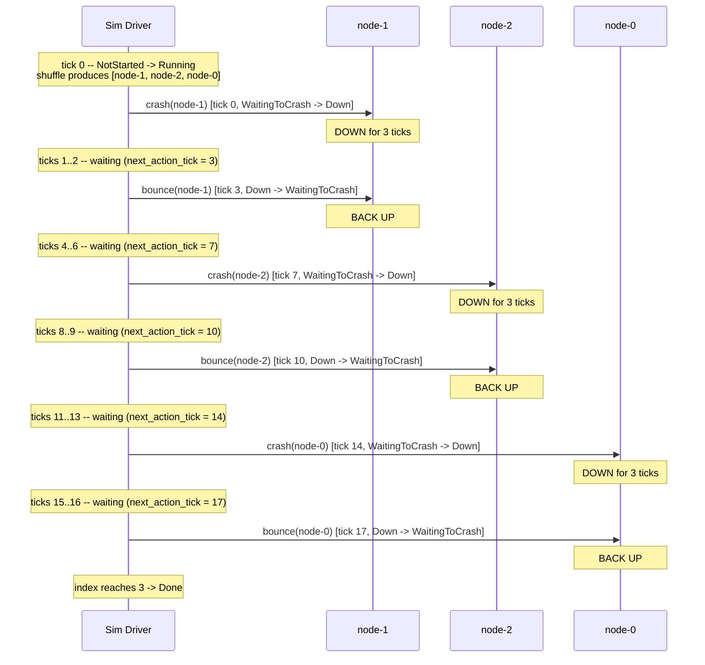

# Fault Patterns

> See also: [ARCHITECTURE.md](../ARCHITECTURE.md) for the overall framework design.

## Table of Contents

- [Overview](#overview)
- [RollingRestart](#rollingrestart)
- [RollingNetworkClog](#rollingnetworkclog)
- [Timeline Example](#timeline-example)
- [Writing Custom Patterns](#writing-custom-patterns)

---

## Overview

The `src/patterns/` module provides **pre-built fault injection patterns** for
deterministic simulation tests. A fault pattern is a self-contained state machine
that, when driven forward tick-by-tick from the simulation step loop, orchestrates
a realistic sequence of failures and recoveries across cluster nodes.

Pre-built patterns are useful because:

- **Realism.** Real-world failures are rarely single-shot. Nodes restart in
  rolling fashion during deployments; network links degrade asymmetrically.
  Pre-built patterns encode these sequences so every test author does not have to
  reinvent them.
- **Determinism.** Each pattern accepts a `Prng` reference and uses it for all
  randomized decisions (shuffle order, subset selection). Given the same seed, the
  pattern produces the identical failure schedule across runs.
- **Composability.** Patterns are plain structs with a `tick()` method and an
  `is_done()` query. You can run multiple patterns concurrently, chain them
  sequentially, or mix them with ad-hoc fault calls on `Sim`.

The module currently exposes two patterns, both re-exported from `src/patterns/mod.rs`:

| Pattern              | Source file              | Simulates                                    |
|----------------------|--------------------------|----------------------------------------------|
| `RollingRestart`     | `patterns/restart.rs`  | Rolling node crashes and bounces             |
| `RollingNetworkClog` | `patterns/swizzle_clog.rs` | Asymmetric, rolling network link degradation |

---

## RollingRestart

**Source:** `src/patterns/restart.rs`

`RollingRestart` simulates a rolling restart across a set of nodes -- the kind of
event triggered by a deployment rollout, a hardware failure sweep, or a
controlled chaos-engineering exercise. Nodes are crashed one at a time, held down
for a configurable duration, then bounced back before the next node is crashed.

### Construction

```rust
use dst_framework::patterns::RollingRestart;
use dst_framework::ids::NodeName;

let pattern = RollingRestart::new(
    vec![
        NodeName::from("node-0"),
        NodeName::from("node-1"),
        NodeName::from("node-2"),
    ],
    ticks_between_crash: 10,  // ticks of healthy operation between successive crashes
    ticks_down: 5,            // ticks a node stays crashed before bounce
);
```

### Fields

| Field                | Type             | Description                                             |
|----------------------|------------------|---------------------------------------------------------|
| `nodes`              | `Vec<NodeName>`  | The full set of nodes eligible for restart.             |
| `ticks_between_crash`| `u64`            | Ticks to wait after a bounce before crashing the next node. |
| `ticks_down`         | `u64`            | Ticks a node remains crashed before it is bounced back. |

### State Machine

The pattern transitions through three top-level states. The `Running` state
contains two sub-phases that alternate for each node in the shuffled order.



### Detailed Walkthrough

1. **NotStarted.** The initial state after construction. On the first call to
   `tick()`, the pattern clones the `nodes` list and shuffles it using
   `rng.inner_mut()`, producing a deterministic permutation. It then transitions
   to `Running` with `index = 0`, `phase = WaitingToCrash`, and
   `next_action_tick = current_step` (immediate action). The method recurses
   once so that the first action fires on the same tick.

2. **Running / WaitingToCrash.** If `current_step < next_action_tick`, the
   method returns early -- the pattern is idle, waiting for the inter-crash
   delay to elapse. Once the tick arrives, it calls `sim.crash(node)` on the
   current node, transitions the phase to `Down`, and sets
   `next_action_tick = current_step + ticks_down`.

3. **Running / Down.** Again waits until `next_action_tick`. Then calls
   `sim.bounce(node)` to bring the node back up, increments `index` to move to
   the next node, resets the phase to `WaitingToCrash`, and sets
   `next_action_tick = current_step + ticks_between_crash`.

4. **Done.** When `index` reaches the length of the shuffled order, the pattern
   transitions to `Done`. Subsequent calls to `tick()` are no-ops.
   `is_done()` returns `true`.

### Error Handling

`tick()` returns `Result<(), Error>`. The `sim.bounce()` call can fail (for
example, if the node was not previously registered). Errors propagate to the
caller.

---

## RollingNetworkClog

**Source:** `src/patterns/swizzle_clog.rs`

`RollingNetworkClog` is inspired by FoundationDB's "swizzle-clog" technique. It
picks a random subset of nodes, then progressively clogs (holds) every network
link from each subset node to every other node in the cluster. Once all links are
clogged, it releases them in a different shuffled order. The result is
**asymmetric, rolling network degradation** that exercises timeout paths, partial
connectivity, and recovery logic.

### Construction

```rust
use dst_framework::patterns::RollingNetworkClog;
use dst_framework::ids::NodeName;

let pattern = RollingNetworkClog::new(
    vec![
        NodeName::from("node-0"),
        NodeName::from("node-1"),
        NodeName::from("node-2"),
    ],
    subset_size: 2,      // how many nodes will have their links clogged
    ticks_between: 3,    // ticks between successive hold/release operations
);
```

### Fields

| Field          | Type             | Description                                                 |
|----------------|------------------|-------------------------------------------------------------|
| `nodes`        | `Vec<NodeName>`  | The full set of nodes in the cluster.                       |
| `subset_size`  | `usize`          | Number of nodes whose links will be clogged. Clamped to `nodes.len()`. |
| `ticks_between`| `u64`            | Ticks between successive clog or unclog operations.         |

### State Machine



### Detailed Walkthrough

1. **NotStarted.** On the first `tick()`, the pattern shuffles `nodes` using the
   seeded RNG and takes the first `subset_size` elements as the affected subset.
   It then generates all directed pairs `(s, n)` where `s` is in the subset and
   `n` is any node in `self.nodes` other than `s`. This pair list forms the
   clogging schedule. The state transitions to `Clogging` with
   `next_clog_tick = current_step` and recurses once for immediate action.

2. **Clogging.** On each eligible tick (when `current_step >= next_clog_tick`),
   the pattern calls `sim.hold(a, b)` on the next pair in `all_pairs`, appends
   the pair to the `clogged` list, advances `clog_index`, and sets
   `next_clog_tick = current_step + ticks_between`. When `clog_index` reaches
   the end of `all_pairs`, it shuffles the `clogged` list into a new
   `unclog_order` and transitions to `Unclogging`.

3. **Unclogging.** Mirrors the clogging phase but calls `sim.release(a, b)` on
   each pair in the shuffled unclog order. Each release is spaced by
   `ticks_between` ticks. When all pairs have been released, the state
   transitions to `Done`.

4. **Done.** All links are restored. `is_done()` returns `true`.

### Pair Generation

For a cluster of nodes `[A, B, C]` with `subset_size = 2` and a shuffle that
selects `[B, A]` as the subset, the generated pairs are:

```
(B, A), (B, C),    // B's links to every other node
(A, B), (A, C)     // A's links to every other node
```

Note that `sim.hold(a, b)` holds the undirected link between `a` and `b`, so
traffic in both directions is clogged until `sim.release(a, b)`.

---

## Timeline Example

The following sequence diagram illustrates a `RollingRestart` across a 3-node
cluster with `ticks_between_crash = 4` and `ticks_down = 3`. Assume the
deterministic shuffle produces the order `[node-1, node-2, node-0]`.



**Total ticks consumed:** For `N` nodes the pattern runs for
`N * ticks_down + (N - 1) * ticks_between_crash` ticks after the initial crash,
plus the initial tick. In this example: `3 * 3 + 2 * 4 = 17` ticks from the
first crash to the last bounce.

---

## Writing Custom Patterns

You can create your own fault pattern by following the same conventions used by
the built-in patterns. There is no mandatory trait to implement -- patterns are
plain structs with a `tick()` method -- but adhering to the established structure
makes patterns interchangeable and predictable.

### 1. Define a State Machine

Model your pattern as an enum with at least three states:

```rust
#[derive(Debug)]
enum MyPatternState {
    NotStarted,
    // ... active states ...
    Done,
}
```

Keeping `NotStarted` as the initial state allows lazy initialization: the
pattern does not touch the simulation until the first `tick()` call, at which
point it can read `current_step` and seed its schedule.

### 2. Accept `Prng` for All Randomness

Every random decision (shuffling, subset selection, coin flips) must go through
the `Prng` reference passed to `tick()`. Never use `thread_rng()` or other
non-deterministic sources.

```rust
use crate::prng::Prng;
use rand::seq::SliceRandom;

// Inside tick():
let mut order = self.nodes.clone();
order.shuffle(rng.inner_mut());
```

### 3. Implement `tick()` and `is_done()`

The `tick()` method is called once per simulation step. It should:

- Return immediately if `current_step` has not reached the next scheduled action.
- Perform at most one action per call (crash, bounce, hold, release).
- Advance internal state so the next action is scheduled.

```rust
impl MyPattern {
    pub fn tick(
        &mut self,
        sim: &mut Sim,
        current_step: u64,
        rng: &mut Prng,
    ) -> Result<(), Error> {
        match &mut self.state {
            MyPatternState::NotStarted => {
                // Initialize schedule, transition to active state.
                // Optionally recurse: self.tick(sim, current_step, rng)
                Ok(())
            }
            // ... active states ...
            MyPatternState::Done => Ok(()),
        }
    }

    pub fn is_done(&self) -> bool {
        matches!(self.state, MyPatternState::Done)
    }
}
```

### 4. Use `Sim` Fault Primitives

Patterns orchestrate faults through the `Sim` API:

| Method                   | Effect                                        |
|--------------------------|-----------------------------------------------|
| `sim.crash(node)`        | Immediately kill a node's runtime.            |
| `sim.bounce(node)`       | Restart a previously crashed node.            |
| `sim.hold(a, b)`         | Hold (clog) the network link from `a` to `b`. |
| `sim.release(a, b)`      | Release a previously held link.               |

### 5. Register and Re-export

Place your pattern source file in `src/patterns/` and add it to
`src/patterns/mod.rs`:

```rust
pub mod my_pattern;
pub use my_pattern::MyPattern;
```

### Example: Driving a Pattern in a Test

```rust
use dst_framework::{Builder, Sim};
use dst_framework::patterns::RollingRestart;
use dst_framework::ids::NodeName;

let mut sim = Builder::new()
    .rng_seed(7)
    // ... register nodes ...
    .build();

let nodes = vec![
    NodeName::from("node-0"),
    NodeName::from("node-1"),
    NodeName::from("node-2"),
];

let mut pattern = RollingRestart::new(nodes, 10, 5);

// Derive a dedicated, deterministic Prng stream for the pattern. `derive_rng`
// returns an owned `Prng` (domain-separated by the salt); there is no `sim.rng()`.
let mut prng = sim.derive_rng(b"rolling_restart");

for step in 0..200 {
    pattern.tick(&mut sim, step, &mut prng)?;
    sim.step()?;
    if pattern.is_done() {
        break;
    }
}
```

---

> See also: [ARCHITECTURE.md](../ARCHITECTURE.md) for the overall framework design.
