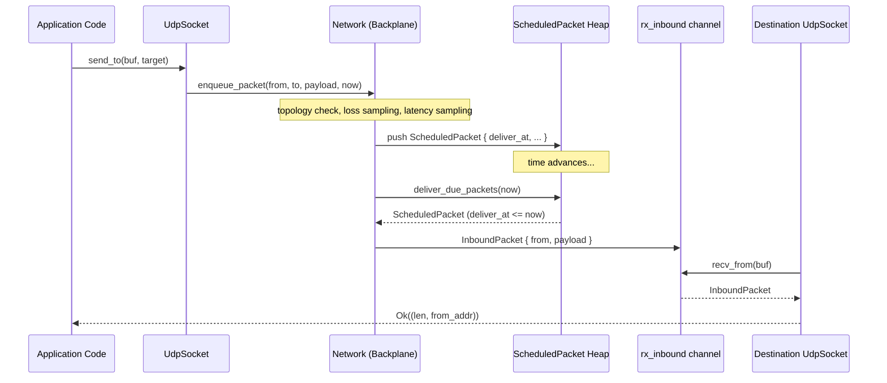
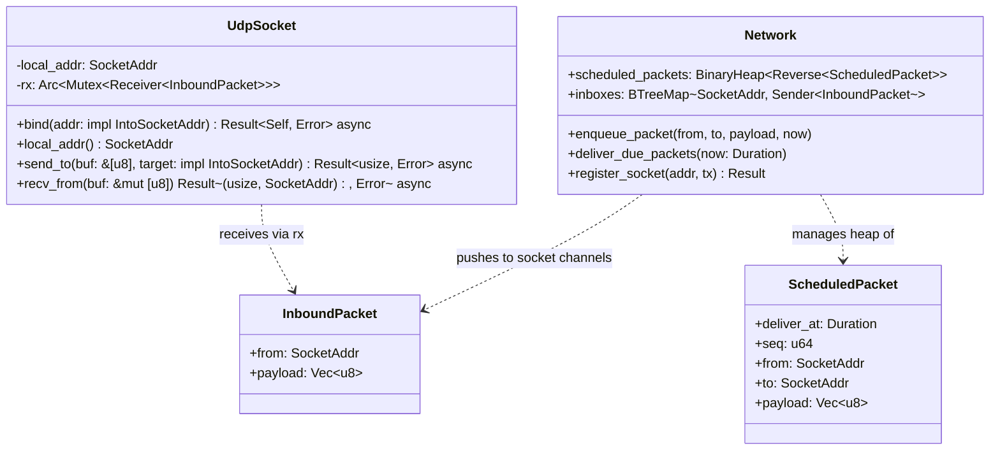

# Network I/O (`src/net/`)

> See also: [ARCHITECTURE.md](../ARCHITECTURE.md) -- sections 5 (Network Substrate) and 6 (Topology & Link States).

The `net` module provides **simulated network I/O** for the DST framework. Application code interacts with types that mirror real socket APIs (`UdpSocket`, `send_to`, `recv_from`), but every byte is routed through the `Network` backplane instead of the kernel network stack. This keeps the entire simulation single-threaded, deterministic, and subject to fault injection (latency, loss, partitions, held packets).

---

## Module Layout

| File | Purpose |
|------|---------|
| `src/net/mod.rs` | Declares the `udp` and `addr` sub-modules and re-exports `UdpSocket`, `InboundPacket`, and `IntoSocketAddr`. |
| `src/net/udp.rs` | `UdpSocket` and `InboundPacket` types. |
| `src/net/addr.rs` | `IntoSocketAddr` trait (pure-parsing address conversion, no DNS). |

---

## UdpSocket Architecture

A `UdpSocket` stores its bound address and the receiving half of a bounded
inbound `mpsc` channel. Outbound sends call the backplane directly through the
active `TickContext`; inbound delivery happens when `Network::deliver_due_packets`
pushes an `InboundPacket` into the destination socket's registered sender.

### Key Types

**`UdpSocket`** -- the simulated socket handle.

| Field | Type | Role |
|-------|------|------|
| `local_addr` | `SocketAddr` | The local address this socket is bound to. |
| `rx` | `Arc<Mutex<mpsc::Receiver<InboundPacket>>>` | Receives datagrams delivered in by the backplane. |

The receiver is wrapped in a `tokio::sync::Mutex` so that `recv_from` can take
an exclusive lock while keeping `UdpSocket` cloneable.

**`InboundPacket`** -- a datagram arriving at the socket.

| Field | Type |
|-------|------|
| `from` | `SocketAddr` |
| `payload` | `Vec<u8>` |

The `to` field is absent from `InboundPacket` because the backplane has already routed the packet to the correct socket; only the sender's address is needed.

### Construction

`UdpSocket::bind(addr)` resolves `0.0.0.0:port` to the active node's IP, creates
a bounded inbound channel with `config.udp_capacity`, and registers the sender
in `Network.inboxes`. Binding an address that already has a live socket returns
an I/O error.

---

## Outbound Path

When application code calls `send_to`:

1. `UdpSocket::send_to(&self, buf, target)` resolves the target address.
2. The call enters `Network::enqueue_packet(self.local_addr, target, payload, now)` through the active `TickContext`.
3. `enqueue_packet` resolves node names from IP addresses, then applies topology checks:
   - If either node is crashed, the link is partitioned, or a matching one-way partition exists, the packet is dropped.
   - Otherwise, the backplane samples loss probability and evaluates packet filters once.
   - A delivery latency is sampled uniformly in `[min_latency, max_latency]`.
   - If the link is held, an admitted `HeldPacket` is queued with its sequence number and original `deliver_at`.
   - Otherwise, the packet is inserted into the scheduled min-heap keyed by `deliver_at`.
4. The scheduled heap is bounded by `config.max_inflight`; packets beyond this limit are dropped.

---

## Inbound Path

When the tick loop advances simulation time:

1. `Network::deliver_due_packets(now)` pops every `ScheduledPacket` whose `deliver_at <= now` from the min-heap.
2. Each popped packet is converted to `InboundPacket { from, payload }`.
3. The packet is pushed into the destination socket's registered inbound sender in `Network.inboxes`.
4. `UdpSocket::recv_from` awaits the receiver (under the `Mutex` lock) and copies the payload into the caller's buffer, returning `(len, from_addr)`.

If the payload is larger than the provided buffer, `recv_from` truncates to `buf.len()` and returns the truncated length -- matching UDP semantics where excess bytes are discarded.

---

## Send/Receive Sequence Diagram

---

## Class Diagram

---

## Name Resolution

Address handling is pure parsing via the `IntoSocketAddr` trait (`src/net/addr.rs`) -- there is **no** DNS or name-to-IP resolution layer. Internally the backplane maps a `NodeName` to its allocated `NodeAddr` via `Network::addr_of` (and back via `Network::name_of`); IPs are allocated sequentially from the `192.168.0.0/16` range by the `AddrPool`. `UdpSocket::bind`/`send_to` accept anything implementing `IntoSocketAddr` (a `SocketAddr`, `(IpAddr, u16)`, or a parseable `&str`/`String`).

---

## Current Status

UDP datagram wiring is fully implemented end-to-end.

- `UdpSocket::bind` allocates a bounded `mpsc::channel` for inbound datagrams and registers the sender with `Network.inboxes` via `register_socket`.
- `UdpSocket::send_to` calls `Network.enqueue_packet`, which (after topology, loss-probability, and content-aware filter checks) schedules the packet on a min-heap by `deliver_at = now + latency`.
- At the start of each tick, `sim::tick::tick_step` calls `deliver_due_packets`, which pops every packet whose `deliver_at <= now` and pushes it into the destination socket's inbound channel.
- `UdpSocket::recv_from` awaits on the inbound channel.

Packet outcomes are recorded in history: `HistoryEvent::PacketDelivered { seq }` on successful socket delivery, and `HistoryEvent::PacketDropped { seq }` for topology-blocked, loss-roll, filter, outbound `max_inflight` overflow, and destination-unbound/closed-at-delivery drops. The distinct `HistoryEvent::PacketDroppedInboxFull { seq }` is recorded when the destination socket's bounded inbox is full at delivery time. Held packets are buffered in the topology's held-packet queue and are not recorded as drops; they are released by `Sim::release` and reinserted into the scheduled heap without re-running admission.

---

> See also: [ARCHITECTURE.md](../ARCHITECTURE.md) for the full framework design.
