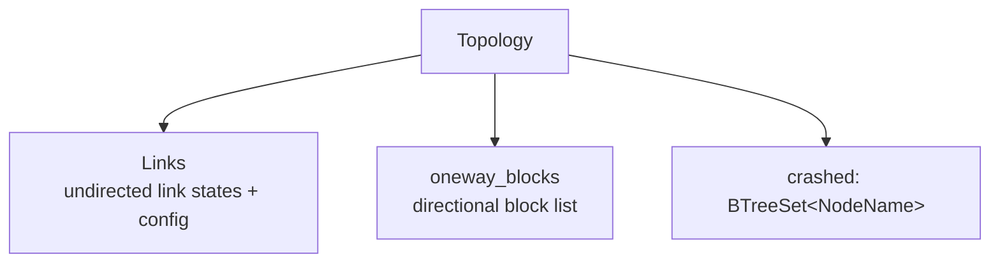
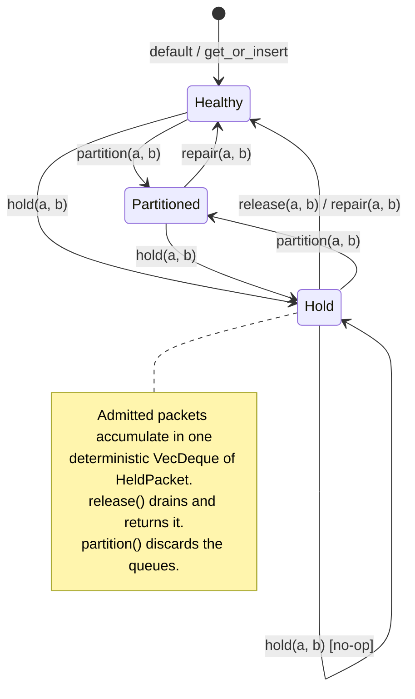
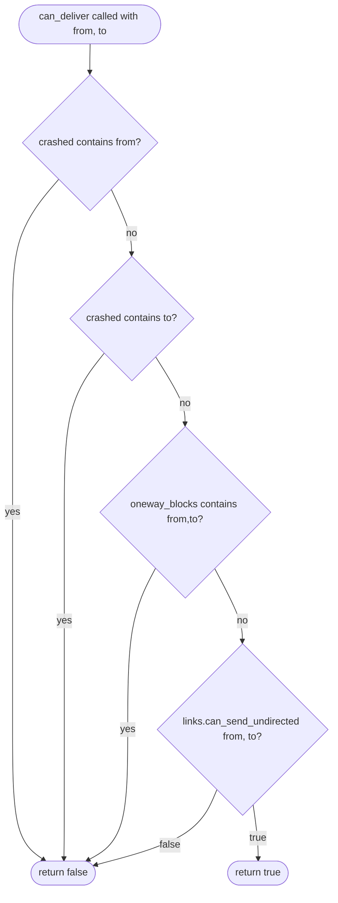
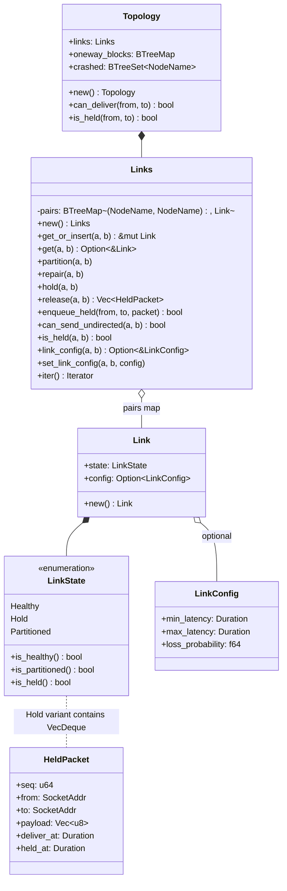

# Network Topology

> Parent document: [ARCHITECTURE.md](../ARCHITECTURE.md)

Source: `src/topology/` -- `mod.rs`, `link.rs`

---

## 1. Overview

The topology module models the full network connectivity graph between nodes in a
deterministic simulation. It answers one question at every tick: **can a message
travel from node A to node B right now?**

Three independent mechanisms can block or delay delivery:

| Mechanism | Scope | Reversible? | Data retained? |
|---|---|---|---|
| **Crashed set** | Per-node | Yes (remove from set) | No |
| **Links** (undirected links) | Per-pair, symmetric | Yes (`repair`, `release`) | Yes (Hold queues) |
| **oneway_blocks** | Per-pair, directional | Yes (`repair_oneway`) | No |

The design is *composite* rather than monolithic: each mechanism lives in its own
struct with its own invariants, and `Topology` composes them behind a single
`can_deliver` check. This keeps the individual pieces testable in isolation while
giving the simulation engine a unified API.

---

## 2. Topology Composition

`Topology` owns all three components and delegates to them in a fixed
priority order.



```rust
pub struct Topology {
    pub links: Links,
    pub oneway_blocks: BTreeMap<(NodeName, NodeName), ()>,
    pub crashed: BTreeSet<NodeName>,
}
```

The struct is `Default`-constructible: all fields start empty, meaning every link
is healthy, no partitions exist, and no nodes are crashed.

---

## 3. Links

`Links` stores **undirected** link state between every pair of nodes that has
been touched. Internally it is a `BTreeMap<(NodeName, NodeName), Link>`.

### 3.1 Canonical Pair Key Ordering

Every public method that accepts a pair `(a, b)` normalizes the key before
lookup:

```rust
fn canonical_pair(a: &NodeName, b: &NodeName) -> (NodeName, NodeName) {
    if a <= b {
        (a.clone(), b.clone())
    } else {
        (b.clone(), a.clone())
    }
}
```

This means `link("x", "y")` and `link("y", "x")` resolve to the same map
entry. The ordering is lexicographic over `NodeName`'s `Ord` implementation,
so the key is always `(min(a,b), max(a,b))`.

### 3.2 Lazy Creation via `get_or_insert`

Links are created on demand. If no entry exists for a pair, `get_or_insert`
inserts a default `Link` (state = `Healthy`, config = `None`) and returns a
mutable reference. All mutating methods (`partition`, `repair`, `hold`,
`release`, `set_link_config`) call through `get_or_insert`, so callers never
need to pre-register node pairs.

Read-only methods (`get`, `can_send_undirected`, `is_held`, `link_config`)
return `None` / a safe default when the pair has never been touched.

### 3.3 BTreeMap Storage

`BTreeMap` (not `HashMap`) is used so that iteration order is deterministic
across runs -- a hard requirement for the DST framework.

### 3.4 Key Methods

| Method | Effect |
|---|---|
| `partition(a, b)` | Set link state to `Partitioned` |
| `repair(a, b)` | Set link state to `Healthy` |
| `hold(a, b)` | Set state to `Hold` with an empty packet queue (no-op if already held) |
| `release(a, b)` | Swap state to `Healthy`, return all queued `HeldPacket`s |
| `enqueue_held(from, to, packet)` | Push an admitted packet into the held queue |
| `can_send_undirected(a, b)` | `true` if no link exists or state is `Healthy` |
| `is_held(a, b)` | `true` if state is `Hold` |
| `set_link_config(a, b, config)` | Attach a per-pair `LinkConfig` override |
| `link_config(a, b)` | Get the per-pair `LinkConfig`, if any |
| `iter()` | Iterate over all `((NodeName, NodeName), &Link)` pairs |

---

## 4. LinkState State Diagram

A link between any two nodes exists in exactly one of three states.



**Queue semantics for Hold:**

- Entering `Hold` initializes an empty `VecDeque<HeldPacket>` queue.
- While in `Hold`, `enqueue_held` appends admitted packets to the queue.
- `release` atomically swaps the state to `Healthy` via `std::mem::replace`
  and returns all held packets in queue order.
- Transitioning to `Partitioned` from `Hold` discards queued messages
  (the old `Hold` variant is dropped).
- Calling `hold` when already in `Hold` is a no-op -- existing queues are
  preserved.

---

## 5. Hold Semantics

Hold is the most complex link state. It does not drop messages; it **buffers**
them so they can be released later in a controlled burst. This is useful for
simulating network freezes, gray failures, and message reordering scenarios.

### 5.1 HeldPacket Identity

Held traffic is represented as `HeldPacket`, not as a fresh message to be sent
again later:

```rust
pub struct HeldPacket {
    pub seq: u64,
    pub from: SocketAddr,
    pub to: SocketAddr,
    pub payload: Vec<u8>,
    pub deliver_at: Duration,
    pub held_at: Duration,
}
```

This preserves the packet's original sequence number, payload, and delivery
deadline. A held packet has already passed topology admission, filters, loss,
and latency calculation. `release` reinserts it into the delivery heap directly
instead of routing it through `enqueue_packet` again.

### 5.2 Queue Ordering

The held queue is a single `VecDeque<HeldPacket>`. This preserves deterministic
queue order across both directions of the undirected link. The delivery heap
still decides final delivery order by `(deliver_at, seq)` after release.

### 5.3 Enqueue / Release Flow

1. The simulation engine admits the packet once: crash/partition checks, loss,
   filters, and latency calculation.
2. If the link is held, it calls `enqueue_held(from, to, packet)`.
3. The packet is appended to the held `VecDeque`.
4. At some later point (driven by a fault schedule or test hook), `release(a, b)`
   is called.
5. `std::mem::replace` swaps the `Hold` variant with `Healthy`, extracting
   the old queue.
6. All packets are returned as a `Vec<HeldPacket>`.
7. The simulation engine reinserts these packets directly into the delivery heap,
   **preserving each packet's original `deliver_at`**. A held packet whose deadline
   has already passed is delivered on the next `deliver_due_packets` pass rather than
   being rewritten -- an earlier `.max(release_time)` was removed because it silently
   reordered held packets whose deadlines straddled the release time (D3/R7).

---

## 6. oneway_blocks

While `Links` models **symmetric** (undirected) failures, `oneway_blocks`
models **asymmetric** (directional) failures. A one-way partition blocks
messages from A to B while still allowing messages from B to A.

### 6.1 Storage

`oneway_blocks` is **not** a separate struct -- it is a field on `Topology`:

```rust
// field of Topology
pub oneway_blocks: BTreeMap<(NodeName, NodeName), ()>,
```

Keys are **directional** `(from, to)` pairs -- no canonical normalization is
applied. Like `Links`, the `BTreeMap` guarantees deterministic iteration. The
value type is the unit type `()`: **key presence alone means "blocked"**, so no
boolean is stored.

### 6.2 Methods

| Method | Effect |
|---|---|
| `Topology::partition_oneway(from, to)` | Insert `(from, to) -> ()` (block this direction) |
| `Topology::repair_oneway(from, to)` | Remove the entry (unblock) |
| `Topology::oneway_open(from, to)` *(private)* | `true` when the `(from, to)` key is absent (path open) |

### 6.3 `oneway_open` Semantics

The directional check is a private helper on `Topology`:

```rust
fn oneway_open(&self, from: &NodeName, to: &NodeName) -> bool {
    !self.oneway_blocks.contains_key(&(from.clone(), to.clone()))
}
```

- If the `(from, to)` key **exists**, `contains_key` is `true`, so `oneway_open`
  returns `false` -- the path is **blocked**.
- If the key is **absent**, `oneway_open` returns `true` -- the path is **open**.

Because keys are directional, `partition_oneway(A, B)` blocks A-to-B but
leaves B-to-A unaffected.

---

## 7. `can_deliver` Algorithm

`Topology::can_deliver` is the top-level predicate the simulation engine
calls before delivering every message. It short-circuits on the first
blocking condition.



**Evaluation order and semantics:**

1. **Crashed check (from)** -- If the sender is crashed, no messages leave.
2. **Crashed check (to)** -- If the receiver is crashed, no messages arrive.
3. **One-way partition** -- Directional block from sender to receiver.
4. **Undirected link** -- Symmetric link state (Healthy allows, Partitioned
   and Hold block).

Note that `can_send_undirected` returns `false` for both `Partitioned` **and**
`Hold` states. `Network::enqueue_packet` checks `is_held` separately so held
traffic is buffered rather than dropped, while partitioned traffic is dropped.

The companion method `is_held(from, to)` lets the engine distinguish between
"dropped" (partitioned/crashed) and "buffered" (held).

---

## 8. Per-Link Config Overrides

Each `Link` carries an optional `LinkConfig`:

```rust
pub struct Link {
    pub state: LinkState,
    pub config: Option<LinkConfig>,
}
```

```rust
pub struct LinkConfig {
    pub min_latency: Duration,
    pub max_latency: Duration,
    pub loss_probability: f64,
}
```

The global `Config` contains a default `LinkConfig` that applies to all
links. `set_link_config(a, b, config)` overrides this for a specific pair,
allowing fine-grained control:

```rust
// Give the link between "db-1" and "db-2" higher latency
links.set_link_config(
    &NodeName::new("db-1"),
    &NodeName::new("db-2"),
    LinkConfig {
        min_latency: Duration::from_millis(50),
        max_latency: Duration::from_millis(200),
        loss_probability: 0.05,
    },
);
```

The simulation engine checks `link_config(a, b)` when computing delivery
delay. If `None`, it falls back to the global config. The per-link config
is orthogonal to link state -- it persists across `partition` / `repair` /
`hold` / `release` transitions because only `link.state` is mutated, never
`link.config` (unless explicitly set again).

---

## 9. Class Diagram



---

> See also: [ARCHITECTURE.md](../ARCHITECTURE.md)
