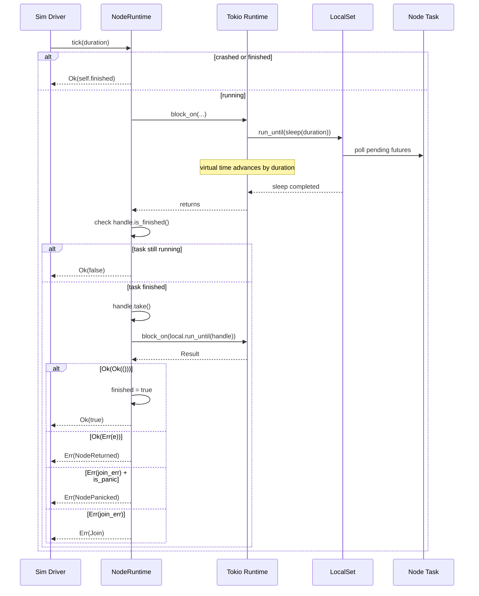

# Node Runtime

> Part of the [DST framework architecture](../ARCHITECTURE.md).

[`src/runtime.rs`](../src/runtime.rs) provides `NodeRuntime`, the per-node Tokio
runtime wrapper that gives each simulated node its own deterministic,
time-controllable execution environment (~200 lines).

---

## 1. Overview

In a deterministic simulation every source of non-determinism must be
controlled. Real wall-clock time is the most obvious offender: two runs of the
same test will never see identical scheduling if they share a single Tokio
runtime whose timer advances with the system clock.

`NodeRuntime` solves this by giving **each node its own `current_thread` Tokio
runtime** created with `start_paused(true)`. Virtual time only advances when the
simulation driver explicitly calls `tick(duration)`. Because the runtime is
single-threaded and paused, all futures execute in a fully deterministic order
that depends only on the tick schedule, never on real wall-clock timing.

This design mirrors the approach taken by Turmoil's `Rt` struct.

---

## 2. Struct Fields

```rust
pub struct NodeRuntime {
    tokio:        Runtime,
    local:        LocalSet,
    handle:       Option<JoinHandle<NodeResult>>,
    task_factory: Option<NodeTaskFactory>,
    node_name:    String,
    is_client:    bool,
    crashed:      bool,
    finished:     bool,
}
```

| Field | Type | Description |
|-------|------|-------------|
| `tokio` | `tokio::runtime::Runtime` | Current-thread Tokio runtime, built with `start_paused(true)`. Owns the timer, I/O driver, and task queues for this node. Rebuilt on `crash()`. |
| `local` | `tokio::task::LocalSet` | Single-threaded executor that confines all `spawn_local` tasks to this node. Rebuilt on `crash()`. |
| `handle` | `Option<JoinHandle<NodeResult>>` | Handle to the node's top-level task. `Some` while the task is running; `None` after the task finishes or the node is crashed. Used in `tick()` to detect completion. |
| `task_factory` | `Option<NodeTaskFactory>` | Closure that produces a fresh `NodeTask` each time it is called. Present only for **host** nodes, enabling `bounce()` to restart the node from scratch. `None` for clients. |
| `node_name` | `String` | Human-readable name used in error messages (`Error::NodePanicked`, `Error::NodeReturned`). |
| `is_client` | `bool` | `true` for one-shot client nodes, `false` for restartable host nodes. |
| `crashed` | `bool` | Set to `true` by `crash()`. While crashed, `tick()` short-circuits and returns `Ok(self.finished)`. Cleared by `bounce()`. |
| `finished` | `bool` | Set to `true` once `tick()` observes that the task handle has completed successfully. Reset to `false` by `crash()`. |

---

## 3. Type Aliases

```rust
pub type NodeTask =
    Pin<Box<dyn Future<Output = NodeResult> + 'static>>;

type NodeTaskFactory = Box<dyn Fn() -> NodeTask>;

// defined in crate::error and re-exported from the crate root:
pub type NodeError = Box<dyn std::error::Error + Send + Sync>;
pub type NodeResult = Result<(), NodeError>;
```

| Alias | Visibility | Purpose |
|-------|------------|---------|
| `NodeTask` | `pub` | A boxed, pinned, `'static` future that represents the entire work a node performs. Its `NodeResult` output lets tasks signal application-level errors back to the sim driver. |
| `NodeTaskFactory` | private | A boxed `Fn` (not `FnOnce`) closure that can produce a fresh `NodeTask` on every call. This is what makes hosts restartable via `bounce()`. |
| `NodeResult` / `NodeError` | `pub` (in `crate::error`) | `NodeResult = Result<(), NodeError>` is the future's output type and the `JoinHandle` parameter. There is **no** `NodeTaskResult` alias. |

---

## 4. Runtime Construction -- `build_runtime()`

```rust
fn build_runtime() -> Result<Runtime, Error> {
    tokio::runtime::Builder::new_current_thread()
        .enable_time()
        .start_paused(true)
        .build()
        .map_err(|e| Error::Io(e.to_string()))
}
```

Three properties matter:

| Builder method | Why |
|----------------|-----|
| `new_current_thread()` | A single-threaded runtime means task scheduling is deterministic -- there is no OS thread scheduler to inject non-determinism. |
| `enable_time()` | Enables `tokio::time::sleep` and related timer utilities. Without this, any code that calls `sleep` would panic. |
| `start_paused(true)` | The Tokio timer starts frozen at the runtime's creation instant. Time only advances when someone calls `tokio::time::advance()` or, equivalently, when there is nothing else to do and the runtime auto-advances to the next timer deadline. This is what makes `tick(duration)` deterministic: the driver sleeps for exactly `duration` of virtual time, and the runtime resolves all timers that fall within that window. |

`build_runtime()` is called in three places:
1. `new_host()` -- initial construction.
2. `new_client()` -- initial construction.
3. `crash()` -- rebuilding the runtime after tearing down the old one.

---

## 5. Spawn and Init -- `spawn_and_init()`

```rust
fn spawn_and_init(
    tokio: &Runtime,
    local: &LocalSet,
    fut: NodeTask,
) -> JoinHandle<NodeResult> {
    tokio.block_on(local.run_until(async {
        let handle = tokio::task::spawn_local(fut);
        tokio::time::sleep(Duration::from_millis(1)).await;
        handle
    }))
}
```

### Step-by-step

1. **`block_on(local.run_until(...))`** -- Enter the Tokio runtime synchronously
   and drive the `LocalSet` until the inner async block completes.

2. **`spawn_local(fut)`** -- Place the node's top-level future onto the
   `LocalSet`. This returns a `JoinHandle` but does **not** poll the future yet.

3. **`sleep(1ms).await`** -- The 1-millisecond alignment sleep serves two
   purposes:
   - It gives the newly spawned task a chance to run its synchronous preamble
     (everything up to its first `.await` point) before `spawn_and_init`
     returns. Without this, the task would not be polled at all until the first
     `tick()`.
   - It aligns all nodes to a common 1ms virtual-time offset, ensuring that
     the very first `tick()` call starts from a consistent baseline across
     every node in the simulation.

4. **Return the `JoinHandle`** -- The handle is stored in
   `NodeRuntime::handle` so that `tick()` can later check whether the task has
   finished.

### Why `#[allow(clippy::async_yields_async)]`?

The inner async block yields a `JoinHandle`, which itself implements `Future`.
Clippy warns that returning a future from an async block is usually a mistake
(the caller probably meant to `.await` it). Here it is intentional: we want
the handle, not the task's result.

---

## 6. Host vs Client

The framework distinguishes two kinds of nodes:

| | Host | Client |
|---|------|--------|
| Constructor | `new_host(name, factory)` | `new_client(name, future)` |
| `task_factory` | `Some(Box<dyn Fn() -> NodeTask>)` | `None` |
| `is_client` | `false` | `true` |
| Restartable? | Yes, via `bounce()` | No -- `bounce()` returns `Err(Error::Config)` |
| Typical use | Long-lived server process (database node, consensus participant) | Short-lived test driver that issues requests and asserts results |

### `new_host(name, factory)`

```rust
pub fn new_host(
    name: String,
    factory: impl Fn() -> NodeTask + 'static,
) -> Result<Self, Error>
```

1. Builds a fresh runtime via `build_runtime()`.
2. Creates a new `LocalSet`.
3. Boxes the factory closure as a `NodeTaskFactory`.
4. Calls `spawn_and_init` with `factory()` to produce and launch the first
   task instance.
5. Returns `NodeRuntime` with `is_client = false` and
   `task_factory = Some(factory)`.

The factory is `Fn` (not `FnOnce`) so it can be called again on every
`bounce()`.

### `new_client(name, future)`

```rust
pub fn new_client(name: String, fut: NodeTask) -> Result<Self, Error>
```

1. Builds a fresh runtime via `build_runtime()`.
2. Creates a new `LocalSet`.
3. Calls `spawn_and_init` with the provided future directly.
4. Returns `NodeRuntime` with `is_client = true` and `task_factory = None`.

Because the future is consumed on first use and there is no factory to
recreate it, client nodes cannot be bounced.

---

## 7. Tick Mechanism -- `tick(duration)`

```rust
pub fn tick(&mut self, duration: Duration) -> Result<bool, Error>
```

`tick` is the simulation driver's primary interface for advancing a node's
virtual time. It returns `Ok(true)` when the node's task has completed
successfully, `Ok(false)` when the node is still running, or `Err(Error)`
when the task failed.

### Detailed walkthrough

```
           tick(duration)
                |
                v
    +-------------------------+
    | crashed || finished?    |
    |   yes -> Ok(finished)   |
    |   no  -> continue       |
    +-------------------------+
                |
                v
    +-------------------------------+
    | block_on(local.run_until(     |
    |   sleep(duration).await       |
    | ))                            |
    +-------------------------------+
                |
                v
    +-------------------------------+
    | handle.is_finished()?         |
    |   no  -> return Ok(false)     |
    |   yes -> take handle          |
    +-------------------------------+
                |
                v
    +-------------------------------+
    | block_on(local.run_until(     |
    |   handle                      |
    | ))                            |
    +-------------------------------+
                |
                v
    +-----------+-----------+
    |           |           |
  Ok(Ok(()))  Ok(Err(e))  Err(join_err)
    |           |           |
    v           v           +-------+-------+
 finished=true  NodeReturned   is_panic?    other
 Ok(true)       Err(...)       |            |
                            NodePanicked  Join
                            Err(...)      Err(...)
```

### Sequence diagram



### Notes on the sleep-based time advance

The call `tokio::time::sleep(duration).await` inside `run_until` is the
mechanism that advances virtual time. Because the runtime was created with
`start_paused(true)`, Tokio will:

1. Check if any tasks are ready to make progress.
2. If no task is ready, auto-advance the clock to the next pending timer
   deadline (up to the sleep's deadline).
3. Wake and poll any tasks whose timers have now fired.
4. Repeat until the sleep itself completes.

This means that a single `tick(Duration::from_secs(1))` call may poll the
node's task many times if that task has internal sub-second timers.

---

## 8. Task Completion Detection

### How finished tasks are detected

After advancing time, `tick()` checks `handle.is_finished()` -- a non-blocking
query on the `JoinHandle`. This avoids blocking indefinitely on a task that is
still running.

If the handle reports completion, `tick()`:

1. **Takes ownership** of the handle via `self.handle.take()`, moving it out of
   the `Option` so it cannot be checked again.
2. **Awaits the handle** via `block_on(local.run_until(handle))` to extract the
   final `Result`.
3. **Sets `self.finished = true`** regardless of whether the result was success
   or error.

### Error propagation paths

| JoinHandle result | Inner result | Error variant | Meaning |
|-------------------|-------------|------------------|---------|
| `Ok(Ok(()))` | -- | (none, returns `Ok(true)`) | Task completed successfully. |
| `Ok(Err(e))` | Application error | `Error::NodeReturned { node, source: e }` | The task's future returned an `Err`. This is an application-level failure (e.g., assertion failure, protocol error). |
| `Err(join_err)` where `join_err.is_panic()` | -- | `Error::NodePanicked { node, reason }` | The task panicked. The panic payload is formatted into `reason`. |
| `Err(join_err)` | -- | `Error::Join(msg)` | The task was cancelled or failed to join for some other reason. |

All error paths set `finished = true` before returning, which means subsequent
`tick()` calls will short-circuit.

---

## 9. Crash -- `crash()`

```rust
pub fn crash(&mut self) -> Result<(), Error>
```

`crash()` simulates a hard node failure -- the equivalent of a process being
killed.

### Step by step

1. **Abort the running task.** If `self.handle` is `Some`, take it and call
   `handle.abort()`. This sends a cancellation signal to the Tokio task,
   causing it to be dropped at its next `.await` point. If the handle is
   already `None` (task previously finished or already crashed), this step is
   a no-op.

2. **Set `self.crashed = true`.** This causes all future `tick()` calls to
   short-circuit immediately.

3. **Set `self.finished = false`.** A crashed node is not considered finished;
   it is in a distinct "crashed" state. This distinction matters for `bounce()`,
   which clears `crashed` and restarts the node.

4. **Rebuild the Tokio runtime.** Call `build_runtime()` to get a fresh
   `Runtime` with a new paused clock. This discards all state from the old
   runtime (pending timers, queued wakers, etc.).

5. **Create a new `LocalSet`.** The old `LocalSet` and all tasks it contained
   are dropped. The node now has a completely clean execution environment.

After `crash()`, the node is inert. It will not make progress until `bounce()`
is called (hosts) or it is replaced entirely (clients).

---

## 10. Bounce -- `bounce()`

```rust
pub fn bounce(&mut self) -> Result<(), Error>
```

`bounce()` simulates a node restart -- crash followed by a clean relaunch from
the task factory.

### Step by step

1. **Call `self.crash()`.** This aborts the current task, rebuilds the runtime,
   and sets `crashed = true`. See section 9 for the full sequence.

2. **Set `self.crashed = false`.** The node is no longer in the crashed state;
   it is about to become a running node again.

3. **Check for a task factory.**
   - **If `task_factory` is `Some`:** Call `factory()` to produce a new
     `NodeTask`, then call `spawn_and_init(&self.tokio, &self.local, factory())`
     to launch it on the freshly-built runtime. Store the resulting
     `JoinHandle` in `self.handle`.
   - **If `task_factory` is `None`:** The node is a client. Return
     `Err(Error::Config("cannot bounce a client (no task factory)"))`.

### Why clients cannot bounce

Client nodes are constructed with `new_client(name, future)`, which consumes
the provided future directly. There is no `Fn` factory to call again, so there
is no way to produce a second instance of the task. This is intentional:
clients represent one-shot test drivers or transient requestors, not long-lived
services that need crash-recovery testing.

### Post-bounce state

After a successful `bounce()`, the `NodeRuntime` fields are:

| Field | Value |
|-------|-------|
| `tokio` | Fresh runtime (from `crash()` rebuild) |
| `local` | Fresh `LocalSet` (from `crash()` rebuild) |
| `handle` | `Some(new_handle)` |
| `task_factory` | Unchanged (`Some(factory)`) |
| `crashed` | `false` |
| `finished` | `false` (set by `crash()`) |

The node's virtual clock starts at zero again. All in-flight state from the
previous incarnation is gone.

---

## 11. Lifecycle State Diagram

```mermaid
stateDiagram-v2
    [*] --> Building : new_host() / new_client()

    Building --> Running : build_runtime() + spawn_and_init() succeed

    Running --> Running : tick(d) returns Ok(false)
    Running --> Finished : tick(d) returns Ok(true) [task completed]
    Running --> ErrorState : tick(d) returns Err(NodeReturned)
    Running --> ErrorState : tick(d) returns Err(NodePanicked)
    Running --> ErrorState : tick(d) returns Err(Join)
    Running --> Crashed : crash()

    Finished --> Finished : tick(d) returns Ok(true) [short-circuits]
    Finished --> Crashed : crash()

    ErrorState --> ErrorState : tick(d) returns Ok(true) [finished=true, short-circuits]
    ErrorState --> Crashed : crash()

    Crashed --> Crashed : tick(d) returns Ok(false) [short-circuits]
    Crashed --> Running : bounce() [host only]
    Crashed --> BounceError : bounce() [client, no factory]

    BounceError --> [*] : Err(Error::Config)

    Building --> [*] : build_runtime() fails with Err(Error::Io)

    note right of Running
        tick() advances virtual time by the
        requested duration, polls the task,
        then checks for completion.
    end note

    note right of Crashed
        Runtime and LocalSet are rebuilt.
        All prior task state is discarded.
        The node is inert until bounce().
    end note

    note right of Finished
        The task returned Ok(()).
        tick() short-circuits on every
        subsequent call.
    end note

    note right of ErrorState
        The task returned Err or panicked.
        finished=true so tick() short-circuits.
        crash() + bounce() can restart hosts.
    end note
```

### Transition summary

| From | Event | To | Return value |
|------|-------|----|-------------|
| Building | construction succeeds | Running | `Ok(NodeRuntime)` |
| Building | `build_runtime()` fails | (terminal) | `Err(Error::Io)` |
| Running | `tick(d)`, task still running | Running | `Ok(false)` |
| Running | `tick(d)`, task returns `Ok(())` | Finished | `Ok(true)` |
| Running | `tick(d)`, task returns `Err(e)` | ErrorState | `Err(Error::NodeReturned)` |
| Running | `tick(d)`, task panics | ErrorState | `Err(Error::NodePanicked)` |
| Running | `tick(d)`, join error | ErrorState | `Err(Error::Join)` |
| Running | `crash()` | Crashed | `Ok(())` |
| Finished | `tick(d)` | Finished | `Ok(true)` |
| Finished | `crash()` | Crashed | `Ok(())` |
| ErrorState | `tick(d)` | ErrorState | `Ok(true)` |
| ErrorState | `crash()` | Crashed | `Ok(())` |
| Crashed | `tick(d)` | Crashed | `Ok(false)` |
| Crashed | `bounce()` on host | Running | `Ok(())` |
| Crashed | `bounce()` on client | (error) | `Err(Error::Config)` |

---

## Accessor Methods

`NodeRuntime` also exposes four read-only accessors:

| Method | Return type | Description |
|--------|-------------|-------------|
| `is_client()` | `bool` | Whether this is a client node. |
| `is_crashed()` | `bool` | Whether the node is currently crashed. |
| `is_finished()` | `bool` | Whether the node's task has completed. |
| `node_name()` | `&str` | The node's name. |

---

> See also: [ARCHITECTURE.md](../ARCHITECTURE.md) for how `NodeRuntime` fits into
> the broader simulation framework.
