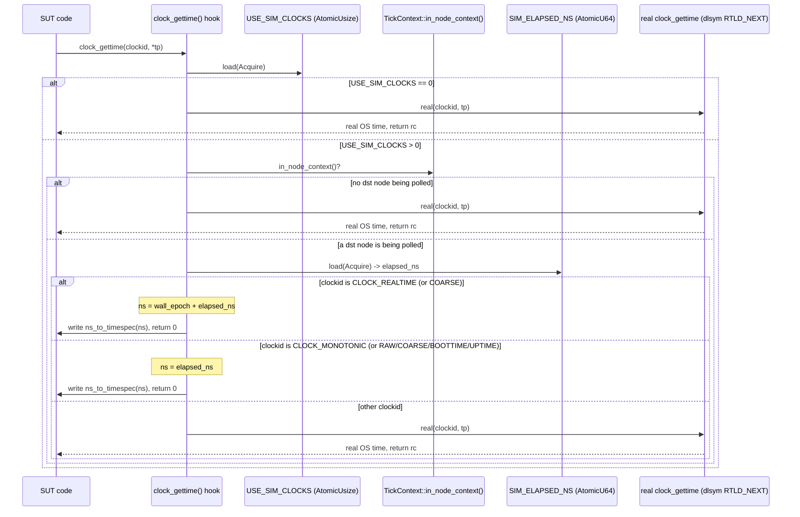
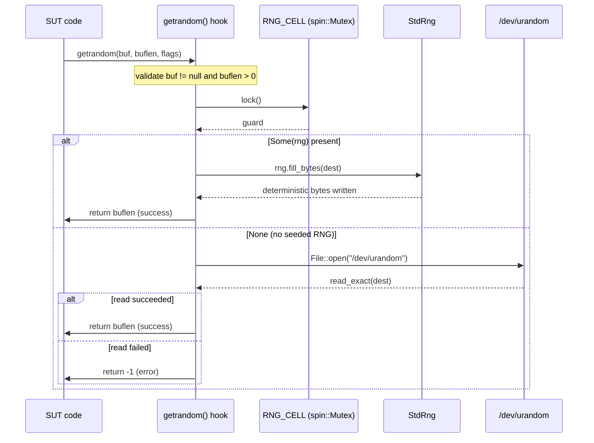
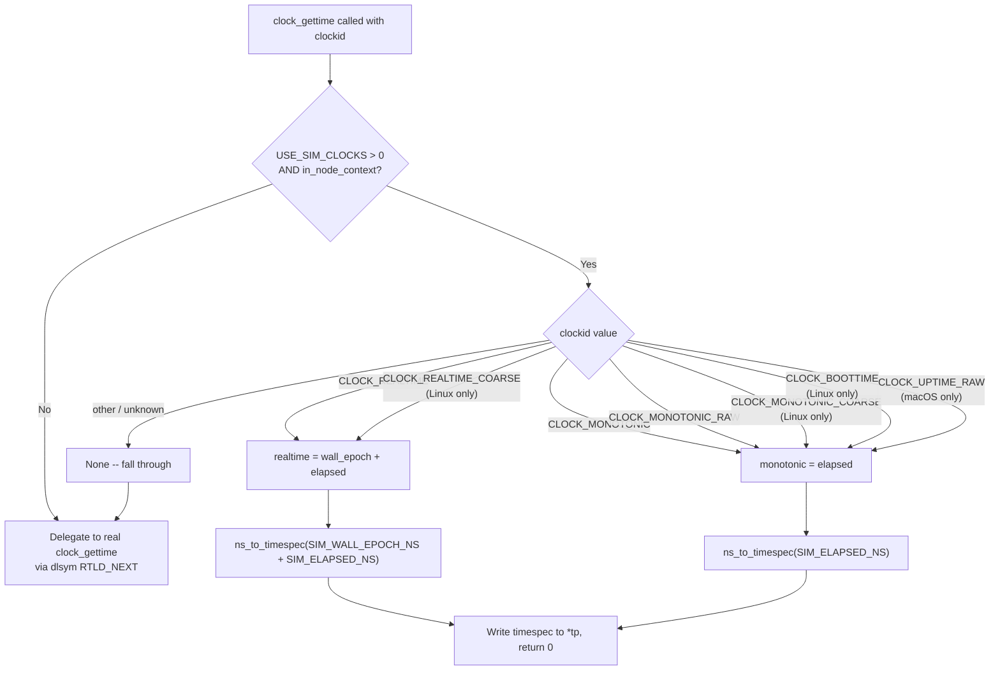
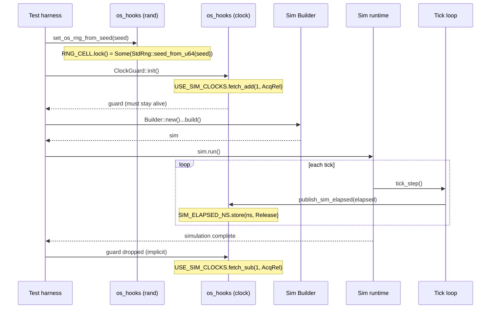

# OS hooks (`os-hooks` feature, default)

> See also [ARCHITECTURE.md](../ARCHITECTURE.md) for overall framework design.

The **`os-hooks`** feature is **enabled by default**. On **Unix**, that links `#[no_mangle]` definitions of:

- `getrandom`, `getentropy`, and on macOS `CCRandomGenerateBytes`
- `clock_gettime`

so callers that would normally read the OS see **deterministic** values during DST.

## Harness ordering

1. Call `dst_framework::os_hooks::set_os_rng_from_seed(u64)` (or `set_os_rng(StdRng)`). Using the same `u64` as `Builder::rng_seed` is a reasonable convention; the framework’s `Prng` is still ChaCha8 over a hashed seed and will not byte-match `StdRng`.
2. If the process may run another sim concurrently (e.g. parallel `cargo test`), hold `dst_framework::os_hooks::clock_test_lock()` for the lifetime of the guard. A concurrent `ClockGuard::init()` from a *different* thread panics loudly rather than silently corrupting the other sim (R5).
3. Keep `dst_framework::os_hooks::ClockGuard::init()` alive for the whole test (drop after the sim and Tokio runtimes shut down). The guard is reference-counted, so nested/overlapping guards on one thread are safe.
4. Build and run `Sim`. **Construction** resets per-process clock state from `Config::epoch` (C2), so sequential sims never read a prior sim's elapsed. Each completed tick — and each node registration/bounce (R8/C1) — publishes sim elapsed via `publish_sim_elapsed`.

> **Time model (E2/R6):** `clock_gettime` sources elapsed from a published
> **atomic** (`SIM_ELAPSED_NS`, not the `TickContext` RefCell — R6, so a clock
> read inside a `UdpSocket` send/bind cannot double-borrow-panic), gated by
> `TickContext::in_node_context()` ("is an active dst node being polled").
> `CLOCK_MONOTONIC*` returns elapsed; `CLOCK_REALTIME*` returns
> `Config::epoch + elapsed` — the two are **distinct** (a SUT diffing them
> sees the configured wall epoch, not `0`). Calls made when no dst node is
> being polled (co-tenant runtimes, other process code) delegate to the real
> `clock_gettime` via `dlsym(RTLD_NEXT)`.

## Constraints

- **`os-clock-hooks` is process-wide: one interposed `clock_gettime` symbol for the whole binary.** The hook returns simulated time **only while a dst node is being polled** (`TickContext::in_node_context()`, a thread-local set during each node tick); every other call — including co-tenant Tokio runtimes (axum, hyper, an HTTP server) and other process code — delegates to the real OS clock via `dlsym(RTLD_NEXT)`. That makes co-tenant runtimes safe in practice, but the symbol is still global and single-copy, so true per-`Sim` isolation is impossible. If you only need deterministic OS entropy and want to avoid clock interposition entirely, depend with `default-features = false, features = ["os-rng-hooks"]` and call `set_os_rng_from_seed` instead of `ClockGuard::install`.
- **One** linked copy of these symbols per final binary. Do not also link another crate that exports the same `#[no_mangle]` names. True per-`Sim` isolation is impossible at the libc layer; `ClockGuard` refcounting + the cross-thread-init panic + `clock_test_lock()` make the shared state safe to use, not isolated.
- **Tokio `Instant` across crash (R8).** `crash()` rebuilds a fresh paused Tokio runtime whose virtual `Instant` resets to a new epoch; Tokio has no API to re-anchor it, so this is physically unfixable. The hooked `clock_gettime`/`std::time` path stays continuous across a crash (sim-global elapsed); SUTs that need cross-crash time continuity must read time through the hook, **not** `tokio::time::Instant::now()`.
- Non-Unix targets compile **stub** `os_hooks` APIs when the feature is enabled so code can build; real interposition is Unix-only.
- `ClockGuard` gates on atomics + a scoped thread-local (`NODE_CTX`), so `clock_gettime` never touches Tokio's TLS. See the enterprise repo's clock/TLS hooks notes for allocator / teardown background.

## `getrandom` crate vs the hook

The Rust `getrandom` crate may resolve `libc::getrandom` in a way that does not hit this crate’s symbol on all link orders. The shared RNG path is still validated by unit tests in `src/os_hooks/rand.rs`.

To build **without** hooks (no extra `libc`/`spin`, no `#[no_mangle]` symbols from this crate), depend with `default-features = false` and avoid enabling `os-hooks`. To get RNG determinism without `clock_gettime` interposition, use `default-features = false, features = ["os-rng-hooks"]`.

## The hook does NOT make SUT `tokio::select!` deterministic — use `tokio-rng-seed`

A common misconception: "the `getrandom` hook is seeded, so everything downstream of OS entropy — including Tokio's `select!` branch ordering — becomes deterministic." **It does not, and cannot.** Verified against tokio 1.52 + std:

- `tokio::select!` picks its start branch from Tokio's per-runtime `FastRand` (`select.rs` → `thread_rng_n` → runtime `seed_generator`). With no explicit seed, that generator is seeded at runtime-build from `std::collections::hash_map::RandomState`.
- `RandomState::new()` reads OS entropy **once per thread** (cached), then `k0.wrapping_add(1)` on every subsequent call (`std/hash/random.rs`). Each node-runtime build pulls a fresh `RngSeed`.
- So even if the hook pins the *base* keys, the per-thread counter keeps advancing — run #2's runtimes get different `FastRand` seeds than run #1's, and `select!` order diverges across same-seed runs in the *same process*. (Empirically: `tests/sim_integration.rs::sut_select_branch_order_deterministic` shows divergence by default.)
- Platform note: macOS std hashmap keys go through `CCRandomGenerateBytes` (hooked here); Linux std uses `weak!`/raw-`getrandom`-syscall resolution that may bypass the `#[no_mangle]` symbol entirely. So the hook's reach into `select!` is best-effort *and* insufficient even where it lands.

The hook's real scope is **OS entropy read directly by dependencies** (e.g. a crate calling `getrandom`/`getentropy`), not Tokio's internal RNG.

**The fix:** the `tokio-rng-seed` feature (off by default). When enabled **and** built with `--cfg tokio_unstable`, each per-node runtime is constructed with `Builder::rng_seed(RngSeed::from_bytes(...))`, seeded from `Prng::derive_stream(sim_seed, node_name)`. That directly pins the `FastRand` driving `select!`, independent of OS entropy and link order. It is double-gated, so without the feature/cfg it compiles to a no-op and changes nothing.

Caveat (from Tokio's own docs): `rng_seed` is unstable, and its determinism is **version-pinned** — Tokio, all deps that touch Tokio, and the rustc version must stay constant for the seed to reproduce. dst does not make `tokio_unstable` a hard requirement (it would be viral for every consumer); it is opt-in for binaries that already use it.

---

## Diagrams

### Clock Interposition Flow

When any code in the process calls `clock_gettime()`, the `#[no_mangle]` hook in
`src/os_hooks/clock.rs` intercepts the call. It checks the `USE_SIM_CLOCKS` refcount first
(a cheap atomic load; if `0`, it delegates straight to the real clock), then confirms a dst
node is being polled, then dispatches based on clock ID.



### Random Interposition Flow

The `getrandom()` hook intercepts OS randomness requests. It locks the global
`RNG_CELL` (a `spin::Mutex`) and fills from the seeded `StdRng` if installed,
falling back to `/dev/urandom` otherwise.



### Clock ID Dispatch

The hook dispatches each `clockid` value to one of two simulated time sources
or falls through to a zero-value fallback.



### Guard Lifecycle

`ClockGuard` controls when the clock hook is active via the `USE_SIM_CLOCKS`
reference count. The guard must be held alive for the entire simulation run;
nested guards are safe (the count just increments).

```mermaid
stateDiagram-v2
    [*] --> Inactive : process starts<br/>USE_SIM_CLOCKS = 0

    Inactive --> Active : ClockGuard::init()<br/>fetch_add(1, AcqRel): 0 -> 1<br/>record ACTIVE_SIM_THREAD
    Active --> Active : nested ClockGuard::init()<br/>fetch_add increments refcount<br/>publish_sim_elapsed() updates SIM_ELAPSED_NS

    Active --> Inactive : last guard.drop()<br/>fetch_sub(1, AcqRel): 1 -> 0<br/>clear ACTIVE_SIM_THREAD
    Inactive --> [*] : process ends
```

### Harness Integration

A typical DST test sets up randomness and clock hooks before building and
running the simulation. The guard must outlive both the sim and the Tokio
runtime.


