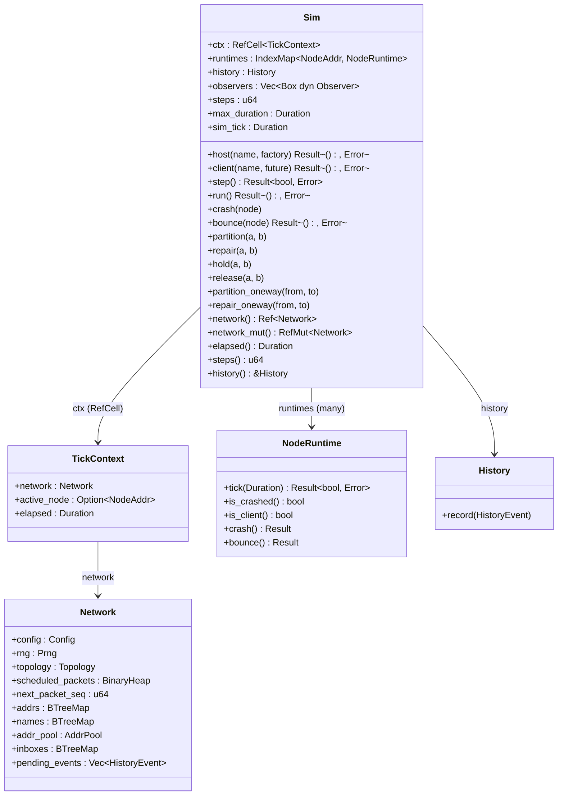
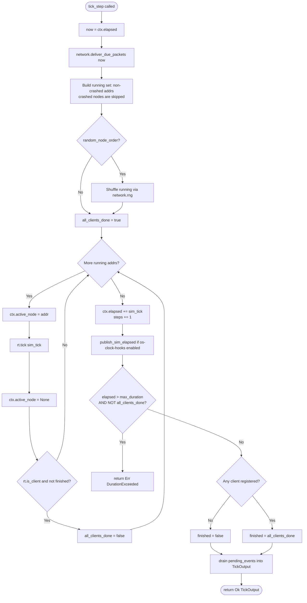
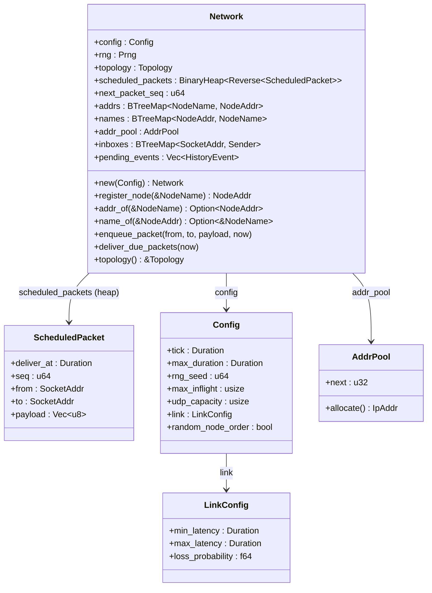
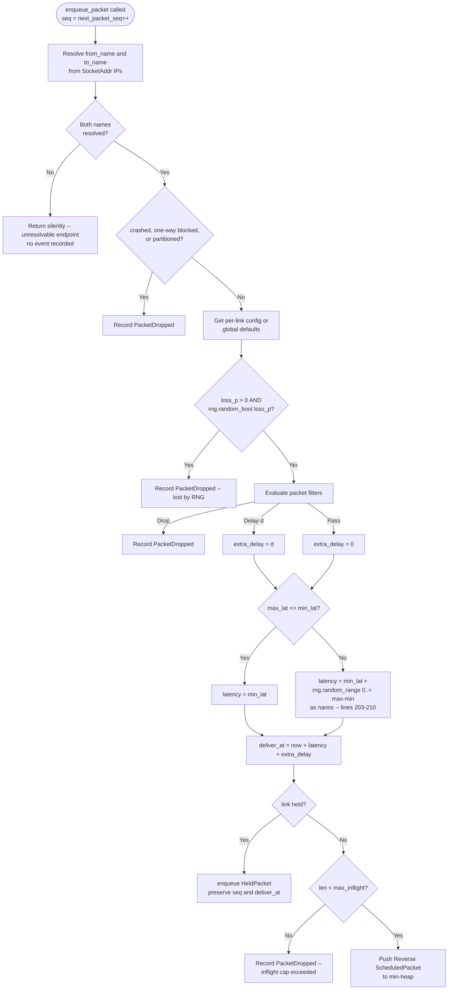
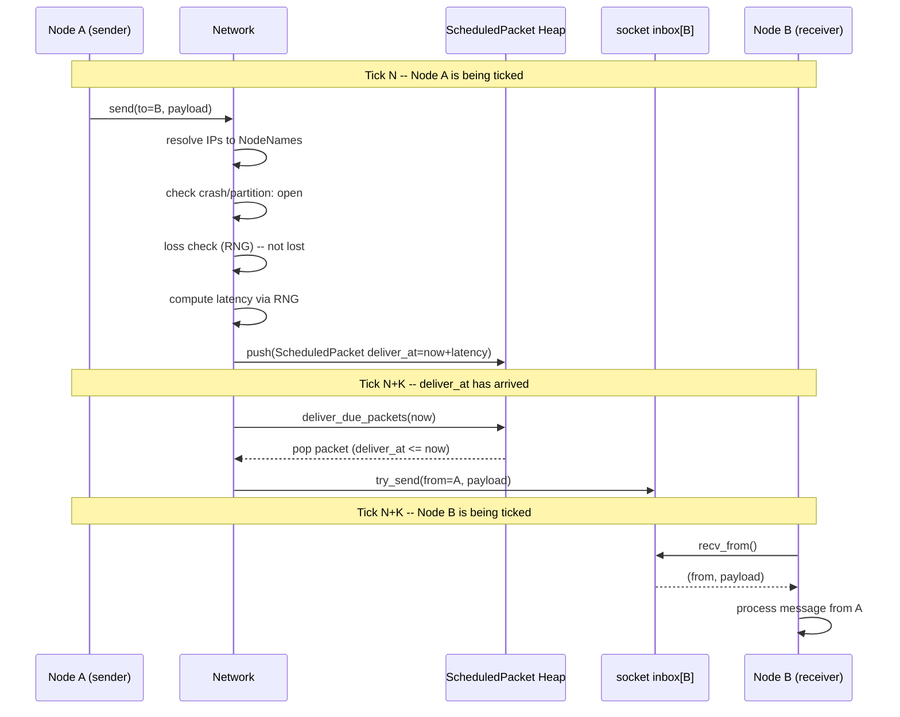
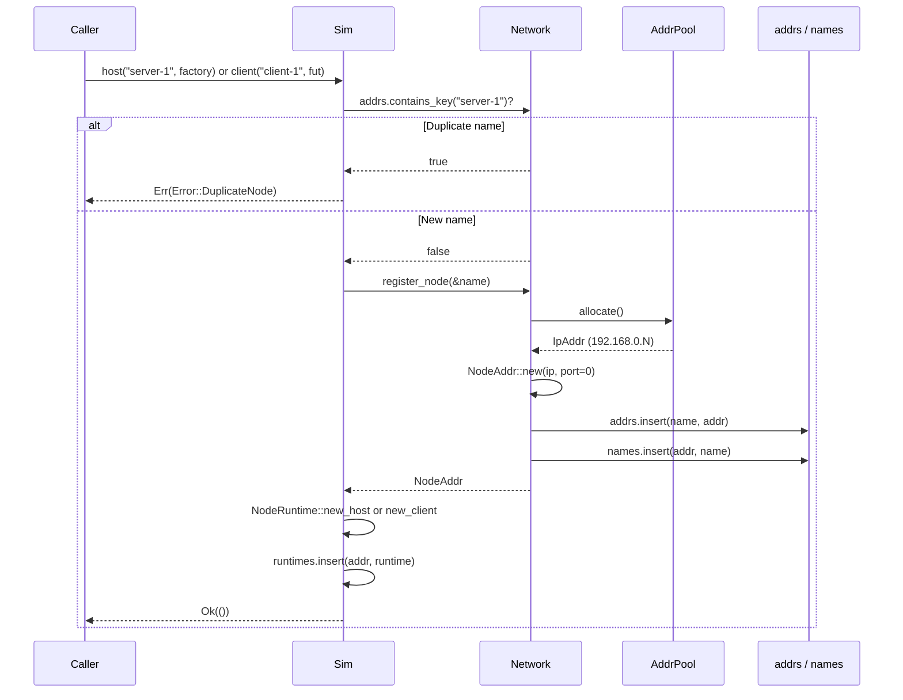

# Simulation Engine (`src/sim/`)

> Part of the DST (Deterministic Simulation Testing) framework.
> See also: [ARCHITECTURE.md](../ARCHITECTURE.md)

---

## 1. Overview

The `src/sim/` module is the core of the DST framework. It provides a
**deterministic, single-threaded simulation engine** that executes multiple
virtual nodes inside one process. Each simulation tick advances a virtual clock,
delivers network packets subject to configurable latency/loss/partitions, and
polls every registered node's async runtime exactly once.

Because the entire execution is driven by a seeded PRNG and a fixed tick cadence,
any run is **perfectly reproducible** given the same seed and topology. This
makes the simulation ideal for finding concurrency bugs, testing fault-injection
scenarios, and verifying distributed protocol invariants.

Key properties:

- **Single-threaded** -- no OS threads; all concurrency is cooperative via
  `Future::poll`.
- **Deterministic** -- seeded RNG controls packet ordering, latency jitter,
  loss decisions, and node execution order.
- **Fault injection** -- first-class API for crash, bounce, partition, hold/
  release, and one-way partitions.
- **Client-driven termination** -- the simulation finishes when all registered
  clients complete (or a step/duration limit is hit).

---

## 2. File Inventory

| File | Lines | Purpose |
|------|------:|---------|
| `mod.rs` | 13 | Re-exports `Builder`, `Config`, `LinkConfig`, `Sim`, `Network`, and the `filter`/`history` types. |
| `builder.rs` | 136 | Fluent `Builder` pattern for constructing a `Sim` with custom `Config`. |
| `core.rs` | 416 | Main `Sim` struct: node registration, tick loop driver, fault-injection API, observer registration. |
| `tick.rs` | 100 | `tick_step()` -- the single-step simulation logic invoked by `Sim::step()`. |
| `context.rs` | 50 | TLS-scoped `TickContext` activated for each node tick. |
| `filter.rs` | 96 | `PacketFilter` trait + `FilterChain` (content-aware filtering). |
| `history.rs` | 139 | `Fault` enum, `HistoryEvent` ring buffer, running SHA-256 hash. |
| `backplane.rs` | 395 | `Network` -- packet scheduling, topology queries, address allocation, inbound delivery, held-packet storage. |

---

## 3. Builder API

`Builder` wraps a `Config` and exposes setter methods via the fluent pattern.
Call `build()` to consume the builder and produce a `Sim`.

```rust
let sim = Builder::new()
    .rng_seed(7)
    .simulation_duration(Duration::from_secs(30))
    .tick_duration(Duration::from_millis(5))
    .message_loss_rate(0.01)
    .build();
```

| Method | Config field set | Default |
|--------|-----------------|---------|
| `simulation_duration(Duration)` | `max_duration` | `10s` |
| `tick_duration(Duration)` | `tick` | `1ms` |
| `rng_seed(u64)` | `rng_seed` | `0` |
| `max_inflight(usize)` | `max_inflight` | `10,000` |
| `udp_capacity(usize)` | `udp_capacity` | `64` |
| `min_message_latency(Duration)` | `link.min_latency` | `0ms` |
| `max_message_latency(Duration)` | `link.max_latency` | `100ms` |
| `message_loss_rate(f64)` | `link.loss_probability` | `0.0` |
| `link_config(LinkConfig)` | `link` (entire struct) | `LinkConfig::default()` |
| `random_node_order(bool)` | `random_node_order` | `false` |

`Builder` also implements `Default`, so `Builder::default()` is equivalent to
`Builder::new()`.

---

## 4. Sim Struct

The `Sim` struct (defined in `core.rs`) owns all simulation state via a
`TickContext` held in a `RefCell` (which carries the network substrate and the
virtual clock), plus every node's async runtime, the event history, registered
observers, and step bookkeeping.



### Node Registration

- **`host(name, factory)`** -- Registers a *restartable* node. The `factory`
  is an `Fn() -> Fut` so the runtime can call it again on `bounce()`. Hosts
  run indefinitely and do not affect simulation termination.
- **`client(name, future)`** -- Registers a *one-shot* node. When all clients
  complete (their future resolves), `step()` returns `Ok(true)` and `run()`
  exits.

Both methods allocate a `NodeAddr` via `Network::register_node`,
guard against duplicate names, and insert the new `NodeRuntime` into the
`runtimes` map.

### Fault-Injection API

| Method | Effect | Reversible via |
|--------|--------|----------------|
| `crash(node)` | Marks node as crashed, stops ticking it, and drops scheduled in-flight packets involving that node. Records `Fault::Crash`. | `bounce(node)` |
| `bounce(node)` | Removes crash flag; re-initializes runtime from factory. Records `Fault::Bounce`. | -- |
| `partition(a, b)` | Bidirectional partition: new and already-scheduled packets between a and b are dropped. | `repair(a, b)` |
| `repair(a, b)` | Removes bidirectional partition. | -- |
| `hold(a, b)` | New and already-scheduled packets between a and b are held as admitted packets, preserving their sequence and delivery time. | `release(a, b)` |
| `release(a, b)` | Reinserts held packets into the delivery heap without re-running loss, filters, capacity checks, or sequencing. | -- |
| `partition_oneway(from, to)` | One-way partition: new and already-scheduled packets from `from` to `to` are dropped; reverse direction is unaffected. | `repair_oneway(from, to)` |
| `repair_oneway(from, to)` | Removes the one-way partition. | -- |

Every fault-injection method records a `HistoryEvent::Fault(...)` for
post-mortem analysis. Faults that remove already-scheduled packets record
`PacketDropped` events immediately after the fault event, in deterministic
delivery order.

---

## 5. Tick Loop Deep Dive

The `tick_step` function in `tick.rs` is the heart of the simulation.
`Sim::step()` delegates directly to it, passing a single `TickInput` struct that
bundles the shared `TickContext` (which owns the `Network` and the virtual
clock), the runtimes map, and the step counter. It returns a `TickOutput`
carrying the completion flag and the events emitted during the tick.

### Function signature (line 34)

```rust
pub(crate) fn tick_step(input: TickInput<'_>) -> Result<TickOutput, Error>

pub(crate) struct TickInput<'a> {
    pub ctx:          &'a RefCell<TickContext>,
    pub runtimes:     &'a mut IndexMap<NodeAddr, NodeRuntime>,
    pub steps:        &'a mut u64,
    pub sim_tick:     Duration,
    pub max_duration: Duration,
}

pub(crate) struct TickOutput {
    pub all_clients_done: bool,
    pub events:           Vec<HistoryEvent>,
}
```

Note there are no separate `network` or `elapsed` parameters -- both live inside
the `TickContext` reached through `ctx`.

### Step-by-step logic

| Phase | Lines | Description |
|-------|------:|-------------|
| 1. Read clock | 43 | `now = ctx.elapsed`. |
| 2. Deliver packets | 45 | Call `network.deliver_due_packets(now)` once, *before* building the running set. Moves all packets with `deliver_at <= now` from the heap into per-target socket inbox channels. |
| 3. Build running set | 47--52 | Iterate `runtimes`; collect non-crashed addrs into `running`. Crashed nodes are simply skipped -- there is no separate `stopped` vector. |
| 4. Shuffle running | 54--57 | If `config.random_node_order`, shuffle `running` using `network.rng` for deterministic reordering. |
| 5. Tick running nodes | 59--75 | For each running addr: set `ctx.active_node`, call `rt.tick(sim_tick)`, clear `active_node`, and if a client is still unfinished set `all_clients_done = false`. |
| 6. Advance time | 77--78 | `ctx.elapsed += sim_tick; *steps += 1;` |
| 7. OS hooks | 80--81 | (Feature-gated on `os-clock-hooks`) Publish `sim_elapsed` via OS hooks for external instrumentation. |
| 8. Duration cap | 83--89 | If `ctx.elapsed > max_duration` and not all clients are done, return `Err(Error::DurationExceeded)`. |
| 9. Compute result | 91--92 | `finished = has_clients && all_clients_done` -- with no registered clients the run is never "done" via this path. |
| 10. Drain events | 94--99 | `std::mem::take` the network's `pending_events` into the returned `TickOutput`. |

### Flowchart



---

## 6. Network Deep Dive

`Network` (defined in `backplane.rs`) is the simulated network fabric.
It owns the PRNG, the topology state (partitions, holds, per-link configs), a
min-heap of scheduled packets, socket inbox senders, and the address-allocation
machinery. The heap is the in-flight link state; socket inboxes represent
packets that have already arrived at an endpoint.

### Class Diagram



### ScheduledPacket Ordering

`ScheduledPacket` implements `Ord` by comparing `deliver_at` first, then `seq`
as a tiebreaker. The heap stores `Reverse<ScheduledPacket>`, making it a
**min-heap** so the earliest-deadline packet is always at the top.

### `enqueue_packet` Decision Flowchart

The `enqueue_packet` method applies topology rules, loss/filter simulation, and
latency calculation before scheduling or holding a packet. Held packets preserve
the same identity and admission decision they would have had in the heap.



### `deliver_due_packets`

This method is called once per tick. It drains all packets whose
`deliver_at <= now` from the min-heap and pushes them into the bound socket's
inbound channel:

```rust
while let Some(Reverse(pkt)) = self.scheduled_packets.peek() {
    if pkt.deliver_at > now { break; }
    let pkt = self.scheduled_packets.pop().unwrap().0;
    if let Some(sender) = self.inboxes.get(&pkt.to) {
        let inbound = InboundPacket { from: pkt.from, payload: pkt.payload };
        sender.try_send(inbound)?;
    }
}
```

`PacketDelivered` means the packet reached the socket inbox. It does not mean
the application has consumed it yet.

### Full Packet Round-Trip Sequence Diagram

This diagram shows the full lifecycle of a packet sent from Node A to Node B
across two simulation ticks.



### Held-Packet API

When a link is held (`Sim::hold(a, b)`), packets that would otherwise be
scheduled into the min-heap are diverted into a per-link held-packet store.
They preserve their assigned `seq` and `deliver_at`, so that on `release()`
they re-enter the heap in the same order they would have had if the link had
been healthy. Filters, loss, and the `max_inflight` cap have already been
evaluated at admission time and are **not** re-applied on release.

These are `pub(crate)` helpers on `Network`:

| Method | Effect |
|--------|--------|
| `hold_scheduled_between(a, b, now) -> usize` | Move all already-scheduled packets between `a` and `b` from the min-heap into the held-packet store; returns the count moved. |
| `drop_scheduled_between(a, b, direction) -> Vec<u64>` | Drop already-scheduled packets between `a` and `b` from the min-heap (`Direction::Both` for `partition`, `Direction::OneWay` for `partition_oneway`); returns the dropped `seq`s. The **caller** records the `PacketDropped` events. |
| `drop_scheduled_for_node(node) -> Vec<u64>` | Drop every scheduled packet that involves `node` (sender or receiver); returns the dropped `seq`s. Used by `crash`. |
| `reinsert_held_packets(packets, now)` | Move a `Vec<HeldPacket>` (produced by `Topology::release`) back into the min-heap on `release()`. |

A separate failure mode, **inbox-full**, occurs when `deliver_due_packets`
tries to push into a full per-socket bounded channel. The packet is dropped
and recorded as `HistoryEvent::PacketDroppedInboxFull`. The bound is set by
the `udp_capacity` config field.

### Packet Filters

`src/sim/filter.rs` provides content-aware filtering that runs inside
`enqueue_packet` after partition/loss checks but before scheduling.

| Symbol | Purpose |
|--------|---------|
| `PacketFilter` (trait) | User-implementable predicate over a `PacketMeta`. |
| `PacketMeta` | `{ from, to, from_name, to_name, payload }` view passed to filters. |
| `FilterDecision` | `Pass`, `Drop`, or `Delay(Duration)` (drop is recorded in history; delay adds extra latency before scheduling). |
| `FilterChain` | Ordered set of installed filters; the first non-`Pass` decision (`Drop` or `Delay`) wins. |
| `ClosureFilter` | Wraps a closure into a `PacketFilter` for ad-hoc tests. |

`Sim::add_packet_filter` / `Sim::clear_filters` record `Fault::FilterAdded` and
`Fault::FilterCleared` (wrapped in `HistoryEvent::Fault`) so filter
installations are part of the deterministic event log.

---

## 7. Node Registration Flow

When `Sim::host()` or `Sim::client()` is called, the following sequence
executes:



### AddrPool Details

`AddrPool` (defined in `src/ids.rs`) assigns sequential IPs in the
`192.168.0.0/16` private range:

- Internal counter starts at `1`.
- Each call to `allocate()` produces `192.168.{next >> 8}.{next & 0xFF}` and
  increments the counter.
- First node gets `192.168.0.1`, second gets `192.168.0.2`, and so on.
- The port component of `NodeAddr` is always `0` at registration time; individual
  sockets bind to specific ports later.

### Bidirectional Maps

`Network` maintains two `BTreeMap`s for O(log n) lookup in either
direction:

| Map | Key | Value | Used by |
|-----|-----|-------|---------|
| `addrs` | `NodeName` | `NodeAddr` | `addr_of`, duplicate check, fault injection |
| `names` | `NodeAddr` | `NodeName` | `name_of`, `name_of_ip` (packet routing) |

The `name_of_ip` helper (lines 387--394) performs a linear scan of
`names` matching by IP only (ignoring port), which is used during
`enqueue_packet` to map socket addresses back to node names for topology
lookups.

---

> See also: [ARCHITECTURE.md](../ARCHITECTURE.md)
